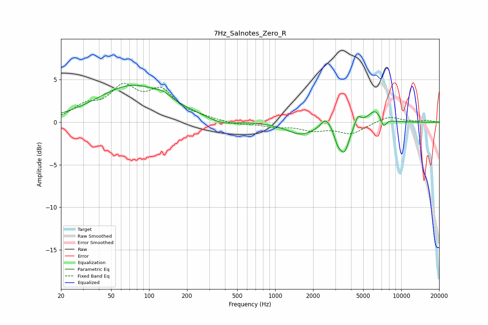

# 7Hz_Salnotes_Zero_R
See [usage instructions](https://github.com/jaakkopasanen/AutoEq#usage) for more options and info.

### Parametric EQs
Apply preamp of -4.4 dB when using parametric equalizer.

|   # | Type    |   Fc (Hz) |    Q |   Gain (dB) |
|-----|---------|-----------|------|-------------|
|   1 | Peaking |        75 | 0.5  |         4.3 |
|   2 | Peaking |       130 | 2.56 |         0.5 |
|   3 | Peaking |       377 | 1.47 |        -0.6 |
|   4 | Peaking |      1613 | 1.26 |        -1.4 |
|   5 | Peaking |      2520 | 3.73 |         1.2 |
|   6 | Peaking |      3120 | 6    |        -1.1 |
|   7 | Peaking |      3529 | 3.48 |        -3.3 |
|   8 | Peaking |      4529 | 5.96 |         1.1 |
|   9 | Peaking |      6222 | 2.36 |         1.6 |
|  10 | Peaking |      7224 | 5.82 |        -1.2 |

### Fixed Band EQs
When using fixed band (also called graphic) equalizer, apply preamp of **-4.7 dB** (if available) and set gains manually with these parameters.

|   # | Type    |   Fc (Hz) |    Q |   Gain (dB) |
|-----|---------|-----------|------|-------------|
|   1 | Peaking |        31 | 1.41 |         1.6 |
|   2 | Peaking |        62 | 1.41 |         3.7 |
|   3 | Peaking |       125 | 1.41 |         3.3 |
|   4 | Peaking |       250 | 1.41 |         0.4 |
|   5 | Peaking |       500 | 1.41 |        -0.3 |
|   6 | Peaking |      1000 | 1.41 |        -0.4 |
|   7 | Peaking |      2000 | 1.41 |        -0.8 |
|   8 | Peaking |      4000 | 1.41 |        -1.3 |
|   9 | Peaking |      8000 | 1.41 |         0.7 |
|  10 | Peaking |     16000 | 1.41 |         0.2 |

### Graphs

