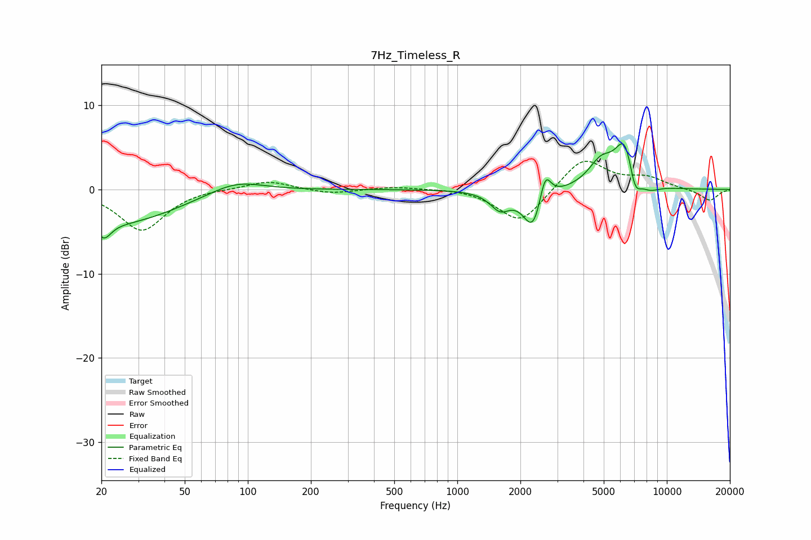

# 7Hz_Timeless_R
See [usage instructions](https://github.com/jaakkopasanen/AutoEq#usage) for more options and info.

### Parametric EQs
Apply preamp of -5.5 dB when using parametric equalizer.

|   # | Type    |   Fc (Hz) |    Q |   Gain (dB) |
|-----|---------|-----------|------|-------------|
|   1 | Peaking |        21 | 4    |        -2.1 |
|   2 | Peaking |        25 | 0.53 |        -3.9 |
|   3 | Peaking |        88 | 1.09 |         1.5 |
|   4 | Peaking |      1599 | 2.97 |        -2.1 |
|   5 | Peaking |      2305 | 3.05 |        -4.9 |
|   6 | Peaking |      2623 | 5.18 |         3.7 |
|   7 | Peaking |      4850 | 2.3  |         2.9 |
|   8 | Peaking |      6328 | 2.89 |         5.8 |
|   9 | Peaking |      7023 | 4.5  |        -3.3 |
|  10 | Peaking |      8254 | 2.78 |        -0.9 |

### Fixed Band EQs
When using fixed band (also called graphic) equalizer, apply preamp of **-3.4 dB** (if available) and set gains manually with these parameters.

|   # | Type    |   Fc (Hz) |    Q |   Gain (dB) |
|-----|---------|-----------|------|-------------|
|   1 | Peaking |        31 | 1.41 |        -4.9 |
|   2 | Peaking |        62 | 1.41 |         0.2 |
|   3 | Peaking |       125 | 1.41 |         1.1 |
|   4 | Peaking |       250 | 1.41 |        -0.5 |
|   5 | Peaking |       500 | 1.41 |         0.4 |
|   6 | Peaking |      1000 | 1.41 |         0.2 |
|   7 | Peaking |      2000 | 1.41 |        -4.1 |
|   8 | Peaking |      4000 | 1.41 |         3.9 |
|   9 | Peaking |      8000 | 1.41 |         1.3 |
|  10 | Peaking |     16000 | 1.41 |        -1.4 |

### Graphs

