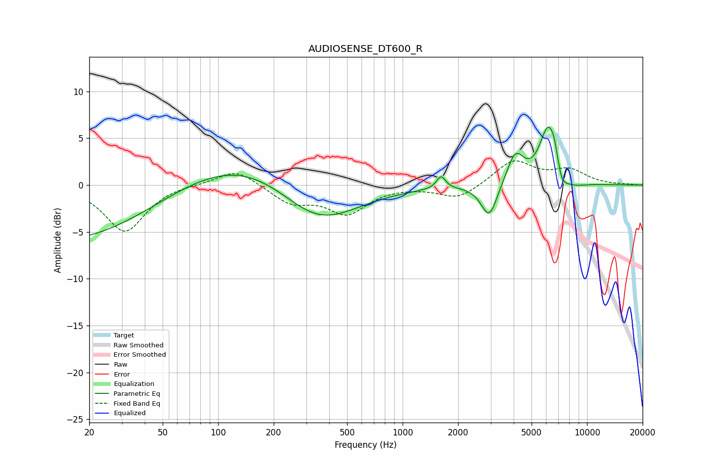

# AUDIOSENSE_DT600_R
See [usage instructions](https://github.com/jaakkopasanen/AutoEq#usage) for more options and info.

### Parametric EQs
Apply preamp of -6.3 dB when using parametric equalizer.

|   # | Type    |   Fc (Hz) |    Q |   Gain (dB) |
|-----|---------|-----------|------|-------------|
|   1 | Peaking |        20 | 0.23 |        -6.9 |
|   2 | Peaking |       100 | 0.32 |         5.1 |
|   3 | Peaking |       344 | 0.64 |        -5.2 |
|   4 | Peaking |      1616 | 5.94 |         1.4 |
|   5 | Peaking |      2950 | 3.22 |        -3.7 |
|   6 | Peaking |      4085 | 3.05 |         3.3 |
|   7 | Peaking |      6141 | 2.89 |         5.9 |
|   8 | Peaking |      6653 | 5.94 |         1.5 |
|   9 | Peaking |      7243 | 4.55 |        -1.8 |
|  10 | Peaking |      8214 | 1.96 |        -0.7 |

### Fixed Band EQs
When using fixed band (also called graphic) equalizer, apply preamp of **-2.7 dB** (if available) and set gains manually with these parameters.

|   # | Type    |   Fc (Hz) |    Q |   Gain (dB) |
|-----|---------|-----------|------|-------------|
|   1 | Peaking |        31 | 1.41 |        -5   |
|   2 | Peaking |        62 | 1.41 |         0.2 |
|   3 | Peaking |       125 | 1.41 |         1.8 |
|   4 | Peaking |       250 | 1.41 |        -1.8 |
|   5 | Peaking |       500 | 1.41 |        -2.9 |
|   6 | Peaking |      1000 | 1.41 |        -0   |
|   7 | Peaking |      2000 | 1.41 |        -1.5 |
|   8 | Peaking |      4000 | 1.41 |         2.6 |
|   9 | Peaking |      8000 | 1.41 |         1.5 |
|  10 | Peaking |     16000 | 1.41 |         0   |

### Graphs

