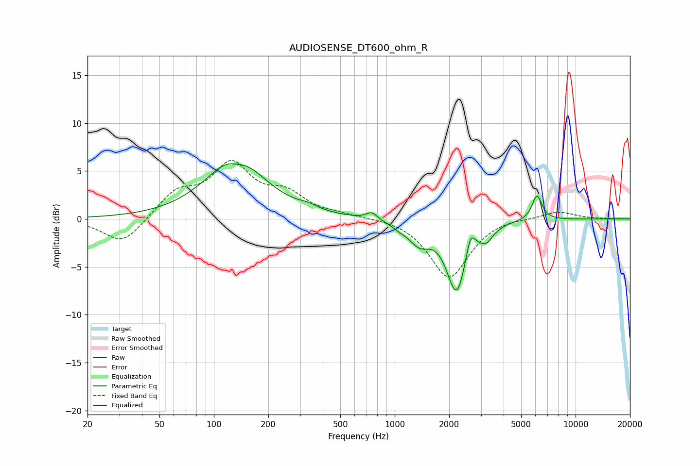

# AUDIOSENSE_DT600_ohm_R
See [usage instructions](https://github.com/jaakkopasanen/AutoEq#usage) for more options and info.

### Parametric EQs
Apply preamp of -5.9 dB when using parametric equalizer.

|   # | Type    |   Fc (Hz) |    Q |   Gain (dB) |
|-----|---------|-----------|------|-------------|
|   1 | Peaking |       132 | 0.89 |         6.4 |
|   2 | Peaking |       135 | 2.76 |        -0.6 |
|   3 | Peaking |       332 | 2.86 |         0.4 |
|   4 | Peaking |       746 | 4.69 |         0.8 |
|   5 | Peaking |      1056 | 3.68 |        -0.3 |
|   6 | Peaking |      1366 | 2.37 |        -2.1 |
|   7 | Peaking |      2197 | 2.62 |        -7.4 |
|   8 | Peaking |      2622 | 6    |         2.2 |
|   9 | Peaking |      3202 | 3.73 |        -1.3 |
|  10 | Peaking |      6121 | 5.11 |         2.6 |

### Fixed Band EQs
When using fixed band (also called graphic) equalizer, apply preamp of **-6.2 dB** (if available) and set gains manually with these parameters.

|   # | Type    |   Fc (Hz) |    Q |   Gain (dB) |
|-----|---------|-----------|------|-------------|
|   1 | Peaking |        31 | 1.41 |        -2.7 |
|   2 | Peaking |        62 | 1.41 |         2.6 |
|   3 | Peaking |       125 | 1.41 |         5.3 |
|   4 | Peaking |       250 | 1.41 |         2.2 |
|   5 | Peaking |       500 | 1.41 |         0.3 |
|   6 | Peaking |      1000 | 1.41 |         0.2 |
|   7 | Peaking |      2000 | 1.41 |        -6.2 |
|   8 | Peaking |      4000 | 1.41 |         0.3 |
|   9 | Peaking |      8000 | 1.41 |         0.8 |
|  10 | Peaking |     16000 | 1.41 |         0   |

### Graphs

