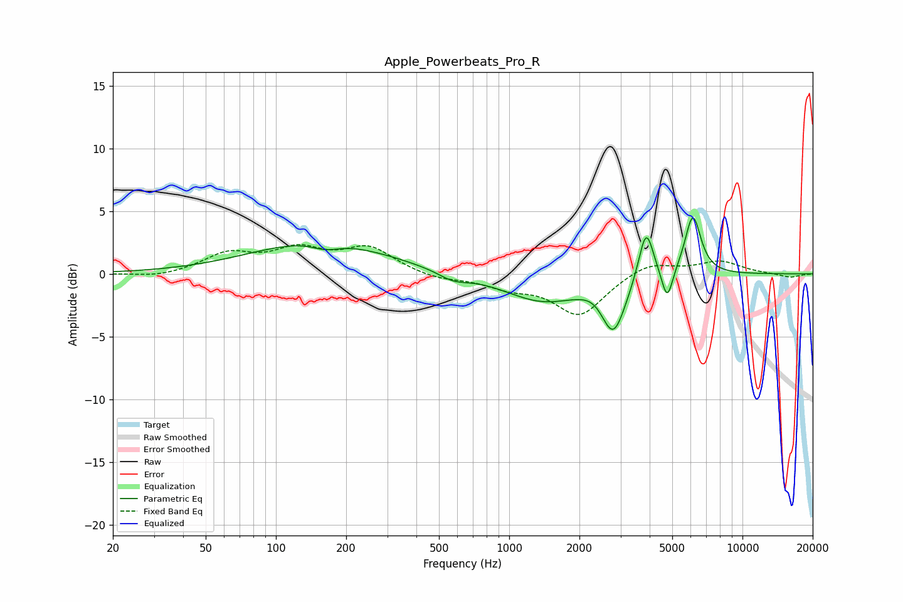

# Apple_Powerbeats_Pro_R
See [usage instructions](https://github.com/jaakkopasanen/AutoEq#usage) for more options and info.

### Parametric EQs
Apply preamp of -4.6 dB when using parametric equalizer.

|   # | Type    |   Fc (Hz) |    Q |   Gain (dB) |
|-----|---------|-----------|------|-------------|
|   1 | Peaking |       154 | 0.5  |         2.6 |
|   2 | Peaking |       165 | 2.21 |        -0.7 |
|   3 | Peaking |       178 | 2.98 |         0.1 |
|   4 | Peaking |       575 | 2.19 |        -0.6 |
|   5 | Peaking |      1388 | 0.85 |        -2.1 |
|   6 | Peaking |      2326 | 2.8  |         0.4 |
|   7 | Peaking |      2797 | 2.71 |        -4.3 |
|   8 | Peaking |      3861 | 4.37 |         4.3 |
|   9 | Peaking |      4758 | 6    |        -2.6 |
|  10 | Peaking |      6127 | 4.05 |         4.8 |

### Fixed Band EQs
When using fixed band (also called graphic) equalizer, apply preamp of **-2.4 dB** (if available) and set gains manually with these parameters.

|   # | Type    |   Fc (Hz) |    Q |   Gain (dB) |
|-----|---------|-----------|------|-------------|
|   1 | Peaking |        31 | 1.41 |        -0.3 |
|   2 | Peaking |        62 | 1.41 |         1.5 |
|   3 | Peaking |       125 | 1.41 |         1.7 |
|   4 | Peaking |       250 | 1.41 |         2   |
|   5 | Peaking |       500 | 1.41 |        -0.4 |
|   6 | Peaking |      1000 | 1.41 |        -0.9 |
|   7 | Peaking |      2000 | 1.41 |        -3.3 |
|   8 | Peaking |      4000 | 1.41 |         1   |
|   9 | Peaking |      8000 | 1.41 |         1   |
|  10 | Peaking |     16000 | 1.41 |        -0.3 |

### Graphs

