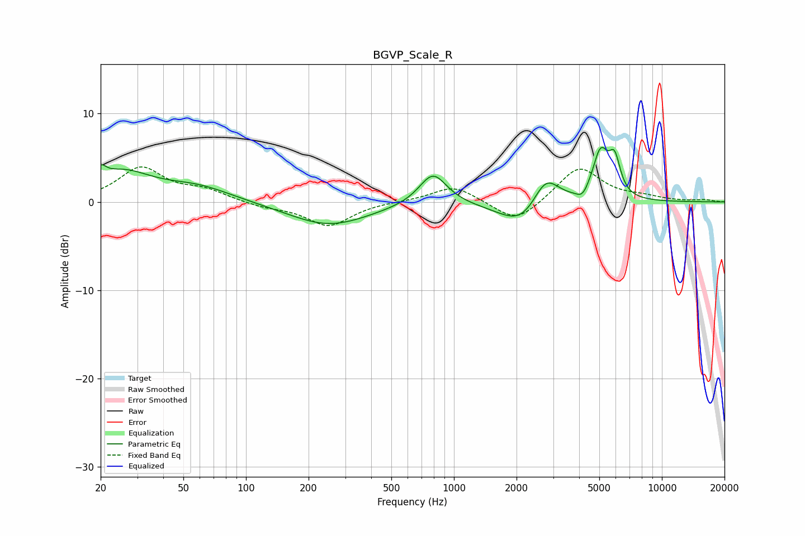

# BGVP_Scale_R
See [usage instructions](https://github.com/jaakkopasanen/AutoEq#usage) for more options and info.

### Parametric EQs
Apply preamp of -6.3 dB when using parametric equalizer.

|   # | Type    |   Fc (Hz) |    Q |   Gain (dB) |
|-----|---------|-----------|------|-------------|
|   1 | Peaking |        20 | 5.79 |         1.3 |
|   2 | Peaking |        25 | 0.99 |         3.2 |
|   3 | Peaking |        58 | 0.84 |         1.6 |
|   4 | Peaking |       250 | 0.73 |        -2.7 |
|   5 | Peaking |       793 | 2.13 |         3.6 |
|   6 | Peaking |      2177 | 1.26 |        -3.4 |
|   7 | Peaking |      2752 | 2.06 |         4.2 |
|   8 | Peaking |      4155 | 5.19 |        -1   |
|   9 | Peaking |      5070 | 3.65 |         5.3 |
|  10 | Peaking |      5927 | 5.04 |         3.8 |

### Fixed Band EQs
When using fixed band (also called graphic) equalizer, apply preamp of **-4.1 dB** (if available) and set gains manually with these parameters.

|   # | Type    |   Fc (Hz) |    Q |   Gain (dB) |
|-----|---------|-----------|------|-------------|
|   1 | Peaking |        31 | 1.41 |         3.8 |
|   2 | Peaking |        62 | 1.41 |         1.2 |
|   3 | Peaking |       125 | 1.41 |        -0.5 |
|   4 | Peaking |       250 | 1.41 |        -2.7 |
|   5 | Peaking |       500 | 1.41 |         0.1 |
|   6 | Peaking |      1000 | 1.41 |         1.9 |
|   7 | Peaking |      2000 | 1.41 |        -2.5 |
|   8 | Peaking |      4000 | 1.41 |         4   |
|   9 | Peaking |      8000 | 1.41 |         0.5 |
|  10 | Peaking |     16000 | 1.41 |         0.2 |

### Graphs

