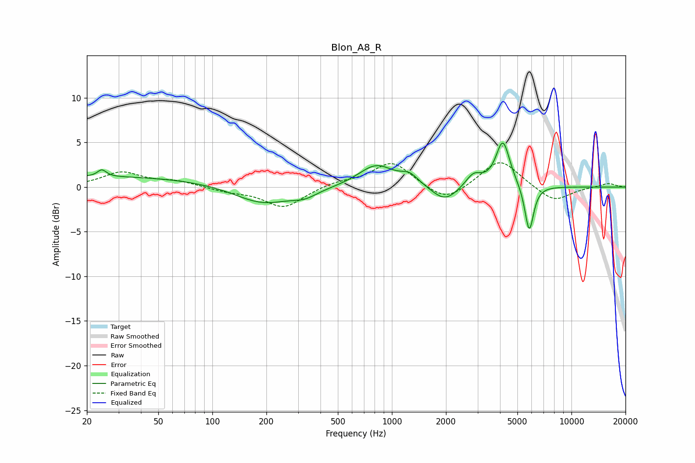

# Blon_A8_R
See [usage instructions](https://github.com/jaakkopasanen/AutoEq#usage) for more options and info.

### Parametric EQs
Apply preamp of -5.0 dB when using parametric equalizer.

|   # | Type    |   Fc (Hz) |    Q |   Gain (dB) |
|-----|---------|-----------|------|-------------|
|   1 | Peaking |        24 | 5.94 |         0.8 |
|   2 | Peaking |        25 | 0.21 |         1.2 |
|   3 | Peaking |       190 | 0.9  |        -2   |
|   4 | Peaking |       327 | 2    |        -0.8 |
|   5 | Peaking |       817 | 1.43 |         2.5 |
|   6 | Peaking |      1255 | 2.89 |         1.1 |
|   7 | Peaking |      1973 | 1.95 |        -1.8 |
|   8 | Peaking |      2853 | 3.15 |         1.5 |
|   9 | Peaking |      4151 | 3.62 |         5.1 |
|  10 | Peaking |      5817 | 5.65 |        -5.3 |

### Fixed Band EQs
When using fixed band (also called graphic) equalizer, apply preamp of **-2.8 dB** (if available) and set gains manually with these parameters.

|   # | Type    |   Fc (Hz) |    Q |   Gain (dB) |
|-----|---------|-----------|------|-------------|
|   1 | Peaking |        31 | 1.41 |         1.6 |
|   2 | Peaking |        62 | 1.41 |         0.6 |
|   3 | Peaking |       125 | 1.41 |        -0.4 |
|   4 | Peaking |       250 | 1.41 |        -2.3 |
|   5 | Peaking |       500 | 1.41 |         0.5 |
|   6 | Peaking |      1000 | 1.41 |         2.8 |
|   7 | Peaking |      2000 | 1.41 |        -1.8 |
|   8 | Peaking |      4000 | 1.41 |         3.2 |
|   9 | Peaking |      8000 | 1.41 |        -1.7 |
|  10 | Peaking |     16000 | 1.41 |         0.4 |

### Graphs

