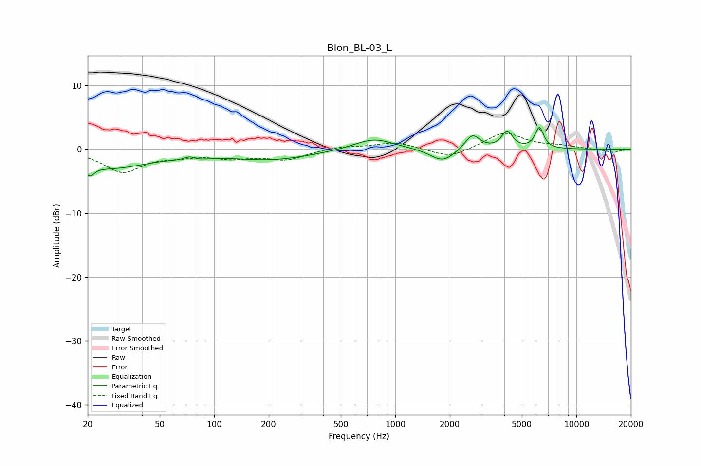

# Blon_BL-03_L
See [usage instructions](https://github.com/jaakkopasanen/AutoEq#usage) for more options and info.

### Parametric EQs
Apply preamp of -3.5 dB when using parametric equalizer.

|   # | Type    |   Fc (Hz) |    Q |   Gain (dB) |
|-----|---------|-----------|------|-------------|
|   1 | Peaking |        21 | 5.94 |        -1.6 |
|   2 | Peaking |        27 | 0.65 |        -2.8 |
|   3 | Peaking |        73 | 3.84 |         1.2 |
|   4 | Peaking |        75 | 2.27 |        -1.1 |
|   5 | Peaking |       207 | 0.62 |        -1.6 |
|   6 | Peaking |       761 | 1.3  |         1.8 |
|   7 | Peaking |      1826 | 2.13 |        -2   |
|   8 | Peaking |      2664 | 3.5  |         2.4 |
|   9 | Peaking |      4142 | 4.76 |         2.6 |
|  10 | Peaking |      6249 | 5.86 |         3.3 |

### Fixed Band EQs
When using fixed band (also called graphic) equalizer, apply preamp of **-2.6 dB** (if available) and set gains manually with these parameters.

|   # | Type    |   Fc (Hz) |    Q |   Gain (dB) |
|-----|---------|-----------|------|-------------|
|   1 | Peaking |        31 | 1.41 |        -3.4 |
|   2 | Peaking |        62 | 1.41 |        -0.7 |
|   3 | Peaking |       125 | 1.41 |        -1.2 |
|   4 | Peaking |       250 | 1.41 |        -1.5 |
|   5 | Peaking |       500 | 1.41 |         0.4 |
|   6 | Peaking |      1000 | 1.41 |         1.1 |
|   7 | Peaking |      2000 | 1.41 |        -1.5 |
|   8 | Peaking |      4000 | 1.41 |         2.6 |
|   9 | Peaking |      8000 | 1.41 |         0.5 |
|  10 | Peaking |     16000 | 1.41 |        -0.5 |

### Graphs

