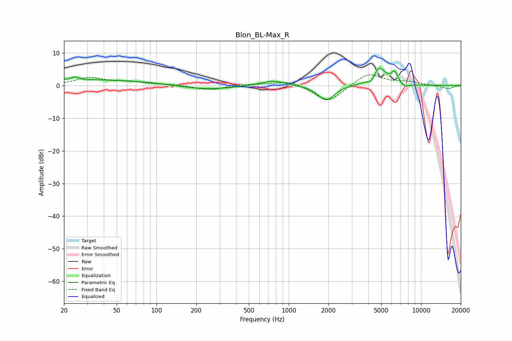

# Blon_BL-Max_R
See [usage instructions](https://github.com/jaakkopasanen/AutoEq#usage) for more options and info.

### Parametric EQs
Apply preamp of -5.4 dB when using parametric equalizer.

|   # | Type    |   Fc (Hz) |    Q |   Gain (dB) |
|-----|---------|-----------|------|-------------|
|   1 | Peaking |        24 | 6    |         0.8 |
|   2 | Peaking |        27 | 0.18 |         1.8 |
|   3 | Peaking |        70 | 2.06 |        -0   |
|   4 | Peaking |       226 | 0.64 |        -1.5 |
|   5 | Peaking |       759 | 1.39 |         1.6 |
|   6 | Peaking |      1919 | 2.33 |        -4.7 |
|   7 | Peaking |      4247 | 4.77 |        -2.3 |
|   8 | Peaking |      4767 | 2.63 |         6.1 |
|   9 | Peaking |      6332 | 5.76 |         3.3 |
|  10 | Peaking |      7525 | 3.9  |        -1.1 |

### Fixed Band EQs
When using fixed band (also called graphic) equalizer, apply preamp of **-3.4 dB** (if available) and set gains manually with these parameters.

|   # | Type    |   Fc (Hz) |    Q |   Gain (dB) |
|-----|---------|-----------|------|-------------|
|   1 | Peaking |        31 | 1.41 |         2.3 |
|   2 | Peaking |        62 | 1.41 |         1   |
|   3 | Peaking |       125 | 1.41 |         0.3 |
|   4 | Peaking |       250 | 1.41 |        -1.4 |
|   5 | Peaking |       500 | 1.41 |         0.4 |
|   6 | Peaking |      1000 | 1.41 |         1.6 |
|   7 | Peaking |      2000 | 1.41 |        -5.2 |
|   8 | Peaking |      4000 | 1.41 |         4   |
|   9 | Peaking |      8000 | 1.41 |         1   |
|  10 | Peaking |     16000 | 1.41 |        -1   |

### Graphs

