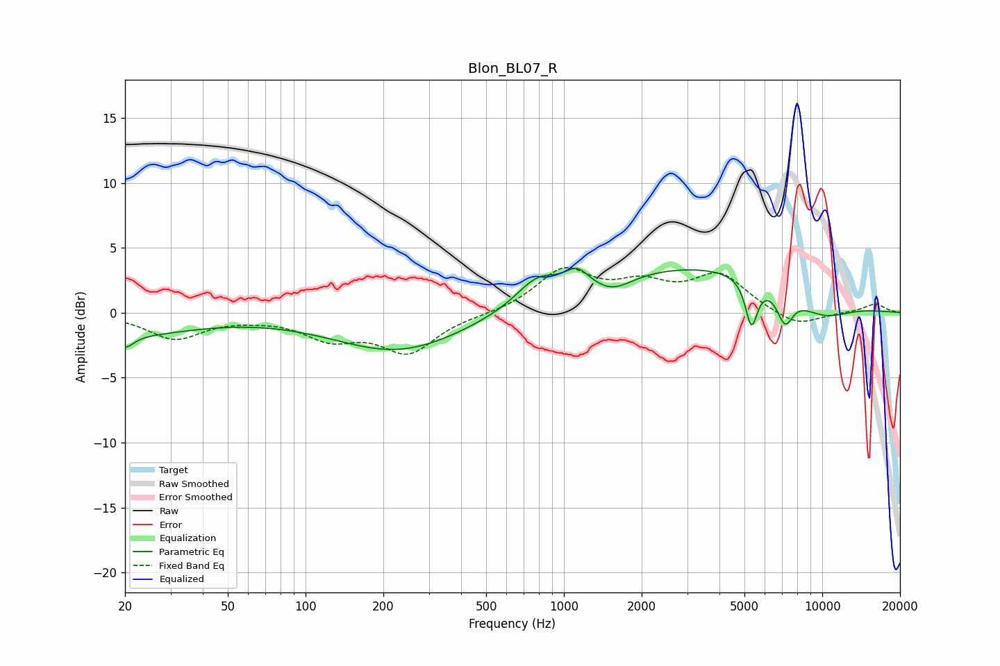

# Blon_BL07_R
See [usage instructions](https://github.com/jaakkopasanen/AutoEq#usage) for more options and info.

### Parametric EQs
Apply preamp of -3.5 dB when using parametric equalizer.

|   # | Type    |   Fc (Hz) |    Q |   Gain (dB) |
|-----|---------|-----------|------|-------------|
|   1 | Peaking |        20 | 0.54 |        -1.6 |
|   2 | Peaking |        20 | 4.35 |        -1   |
|   3 | Peaking |       230 | 0.56 |        -3   |
|   4 | Peaking |       789 | 1.74 |         1.9 |
|   5 | Peaking |      1124 | 3.1  |         1.4 |
|   6 | Peaking |      1546 | 1.92 |        -1.1 |
|   7 | Peaking |      3403 | 0.31 |         3.6 |
|   8 | Peaking |      5322 | 5.94 |        -3.6 |
|   9 | Peaking |      7175 | 4.3  |        -2.4 |
|  10 | Peaking |      9932 | 1.04 |        -1.8 |

### Fixed Band EQs
When using fixed band (also called graphic) equalizer, apply preamp of **-3.6 dB** (if available) and set gains manually with these parameters.

|   # | Type    |   Fc (Hz) |    Q |   Gain (dB) |
|-----|---------|-----------|------|-------------|
|   1 | Peaking |        31 | 1.41 |        -1.9 |
|   2 | Peaking |        62 | 1.41 |        -0.2 |
|   3 | Peaking |       125 | 1.41 |        -1.8 |
|   4 | Peaking |       250 | 1.41 |        -2.9 |
|   5 | Peaking |       500 | 1.41 |        -0.1 |
|   6 | Peaking |      1000 | 1.41 |         3.2 |
|   7 | Peaking |      2000 | 1.41 |         1.8 |
|   8 | Peaking |      4000 | 1.41 |         2.8 |
|   9 | Peaking |      8000 | 1.41 |        -1.1 |
|  10 | Peaking |     16000 | 1.41 |         0.7 |

### Graphs

