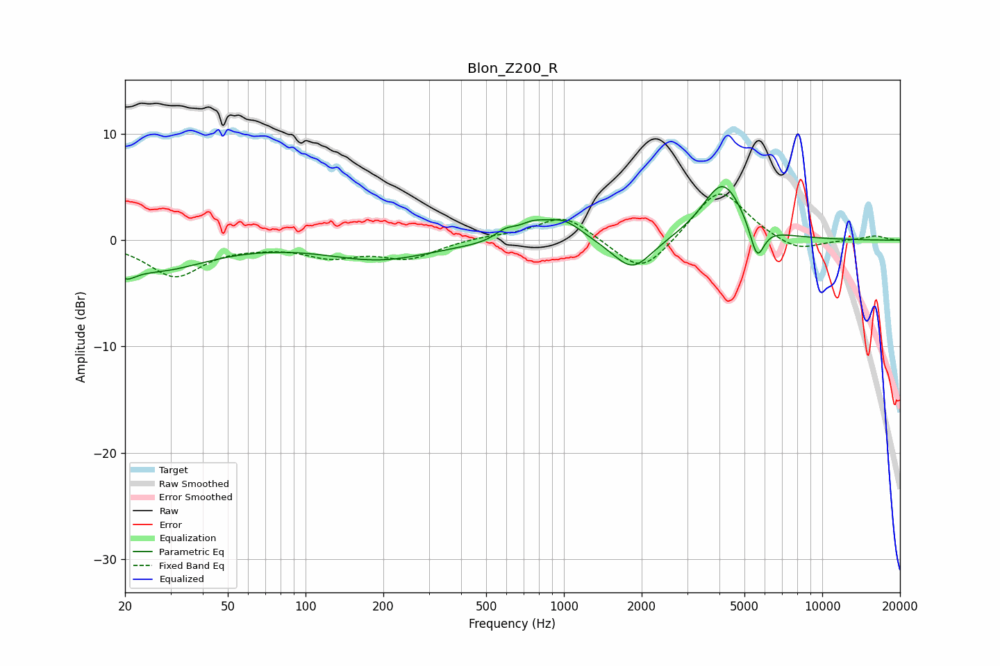

# Blon_Z200_R
See [usage instructions](https://github.com/jaakkopasanen/AutoEq#usage) for more options and info.

### Parametric EQs
Apply preamp of -5.1 dB when using parametric equalizer.

|   # | Type    |   Fc (Hz) |    Q |   Gain (dB) |
|-----|---------|-----------|------|-------------|
|   1 | Peaking |        20 | 3.53 |        -1.4 |
|   2 | Peaking |        27 | 0.74 |        -2.7 |
|   3 | Peaking |       194 | 0.7  |        -1.8 |
|   4 | Peaking |       595 | 3.16 |         1.1 |
|   5 | Peaking |       669 | 1.6  |        -0.8 |
|   6 | Peaking |       746 | 2.25 |         1.7 |
|   7 | Peaking |       996 | 1.86 |         1.9 |
|   8 | Peaking |      1844 | 1.85 |        -3.1 |
|   9 | Peaking |      4120 | 1.76 |         5.5 |
|  10 | Peaking |      5593 | 4.98 |        -3.4 |

### Fixed Band EQs
When using fixed band (also called graphic) equalizer, apply preamp of **-4.4 dB** (if available) and set gains manually with these parameters.

|   # | Type    |   Fc (Hz) |    Q |   Gain (dB) |
|-----|---------|-----------|------|-------------|
|   1 | Peaking |        31 | 1.41 |        -3.3 |
|   2 | Peaking |        62 | 1.41 |        -0.3 |
|   3 | Peaking |       125 | 1.41 |        -1.4 |
|   4 | Peaking |       250 | 1.41 |        -1.6 |
|   5 | Peaking |       500 | 1.41 |         0.3 |
|   6 | Peaking |      1000 | 1.41 |         2.4 |
|   7 | Peaking |      2000 | 1.41 |        -3.5 |
|   8 | Peaking |      4000 | 1.41 |         5   |
|   9 | Peaking |      8000 | 1.41 |        -1.2 |
|  10 | Peaking |     16000 | 1.41 |         0.4 |

### Graphs

