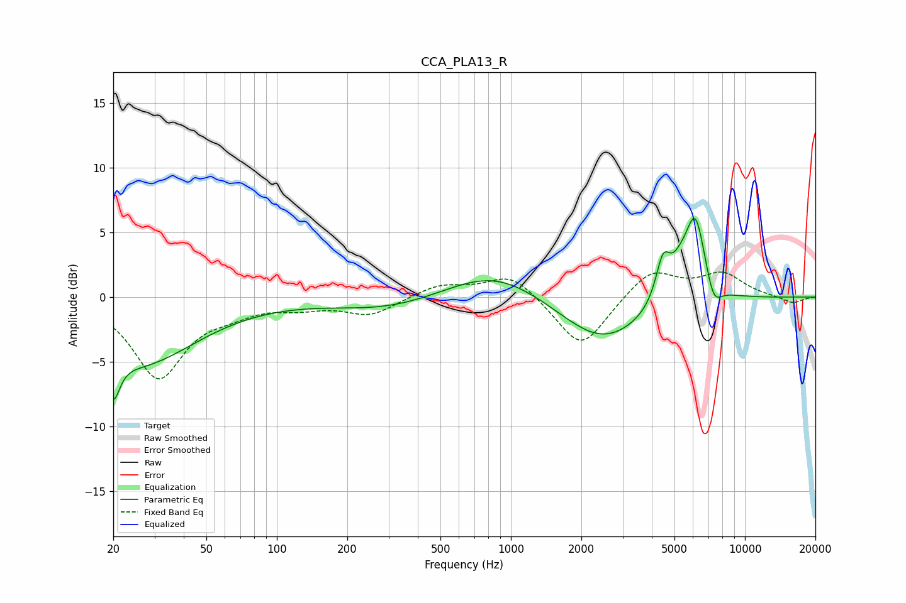

# CCA_PLA13_R
See [usage instructions](https://github.com/jaakkopasanen/AutoEq#usage) for more options and info.

### Parametric EQs
Apply preamp of -6.2 dB when using parametric equalizer.

|   # | Type    |   Fc (Hz) |    Q |   Gain (dB) |
|-----|---------|-----------|------|-------------|
|   1 | Peaking |        20 | 5.3  |        -3.1 |
|   2 | Peaking |        25 | 0.57 |        -5.1 |
|   3 | Peaking |       302 | 0.61 |        -1   |
|   4 | Peaking |       848 | 0.69 |         2.3 |
|   5 | Peaking |      2472 | 0.78 |        -3.6 |
|   6 | Peaking |      4467 | 4.45 |         3.3 |
|   7 | Peaking |      5284 | 3.15 |         1.5 |
|   8 | Peaking |      6140 | 3.09 |         6.1 |
|   9 | Peaking |      6388 | 3.48 |         0.2 |
|  10 | Peaking |      7338 | 4.09 |        -1.9 |

### Fixed Band EQs
When using fixed band (also called graphic) equalizer, apply preamp of **-2.0 dB** (if available) and set gains manually with these parameters.

|   # | Type    |   Fc (Hz) |    Q |   Gain (dB) |
|-----|---------|-----------|------|-------------|
|   1 | Peaking |        31 | 1.41 |        -6.1 |
|   2 | Peaking |        62 | 1.41 |        -0.8 |
|   3 | Peaking |       125 | 1.41 |        -0.6 |
|   4 | Peaking |       250 | 1.41 |        -1.3 |
|   5 | Peaking |       500 | 1.41 |         0.9 |
|   6 | Peaking |      1000 | 1.41 |         1.9 |
|   7 | Peaking |      2000 | 1.41 |        -4.1 |
|   8 | Peaking |      4000 | 1.41 |         2.2 |
|   9 | Peaking |      8000 | 1.41 |         1.7 |
|  10 | Peaking |     16000 | 1.41 |        -0.5 |

### Graphs

