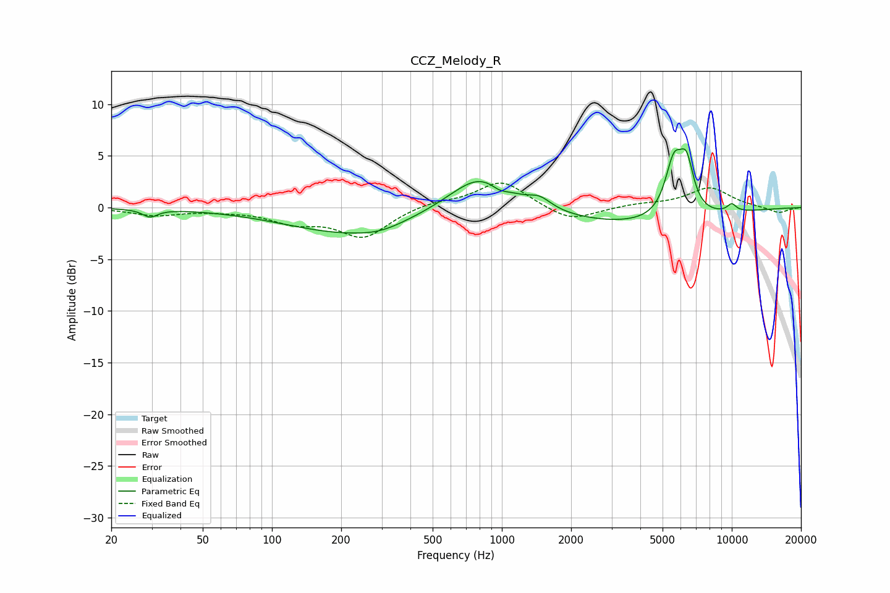

# CCZ_Melody_R
See [usage instructions](https://github.com/jaakkopasanen/AutoEq#usage) for more options and info.

### Parametric EQs
Apply preamp of -5.8 dB when using parametric equalizer.

|   # | Type    |   Fc (Hz) |    Q |   Gain (dB) |
|-----|---------|-----------|------|-------------|
|   1 | Peaking |        29 | 4.51 |        -0.8 |
|   2 | Peaking |       215 | 0.51 |        -2.4 |
|   3 | Peaking |       296 | 1.42 |        -0.5 |
|   4 | Peaking |       806 | 1.06 |         3.6 |
|   5 | Peaking |       976 | 3.82 |        -0.6 |
|   6 | Peaking |      1462 | 2.87 |         0.9 |
|   7 | Peaking |      3696 | 0.41 |        -1.7 |
|   8 | Peaking |      5595 | 3.67 |         5.1 |
|   9 | Peaking |      6358 | 4.43 |         4.3 |
|  10 | Peaking |     10000 | 5.98 |         0.8 |

### Fixed Band EQs
When using fixed band (also called graphic) equalizer, apply preamp of **-2.5 dB** (if available) and set gains manually with these parameters.

|   # | Type    |   Fc (Hz) |    Q |   Gain (dB) |
|-----|---------|-----------|------|-------------|
|   1 | Peaking |        31 | 1.41 |        -0.7 |
|   2 | Peaking |        62 | 1.41 |        -0.2 |
|   3 | Peaking |       125 | 1.41 |        -1.3 |
|   4 | Peaking |       250 | 1.41 |        -2.8 |
|   5 | Peaking |       500 | 1.41 |         0.5 |
|   6 | Peaking |      1000 | 1.41 |         2.6 |
|   7 | Peaking |      2000 | 1.41 |        -1.4 |
|   8 | Peaking |      4000 | 1.41 |         0.3 |
|   9 | Peaking |      8000 | 1.41 |         1.9 |
|  10 | Peaking |     16000 | 1.41 |        -0.6 |

### Graphs

