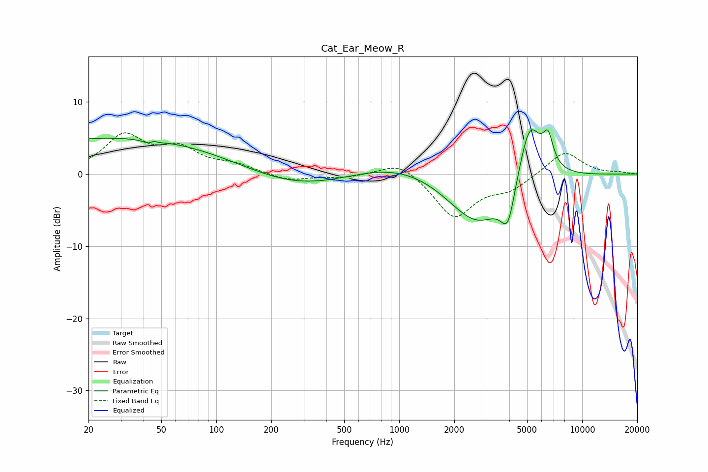

# Cat_Ear_Meow_R
See [usage instructions](https://github.com/jaakkopasanen/AutoEq#usage) for more options and info.

### Parametric EQs
Apply preamp of -6.2 dB when using parametric equalizer.

|   # | Type    |   Fc (Hz) |    Q |   Gain (dB) |
|-----|---------|-----------|------|-------------|
|   1 | Peaking |        20 | 0.18 |         4.1 |
|   2 | Peaking |        45 | 4.95 |        -3.1 |
|   3 | Peaking |        45 | 5.57 |         2.9 |
|   4 | Peaking |        63 | 0.26 |         1.2 |
|   5 | Peaking |       279 | 0.49 |        -2.5 |
|   6 | Peaking |      1066 | 0.49 |         2.3 |
|   7 | Peaking |      2691 | 0.81 |        -7.8 |
|   8 | Peaking |      3933 | 3.57 |        -5.6 |
|   9 | Peaking |      5161 | 2.08 |         9.3 |
|  10 | Peaking |      6509 | 4.93 |         3.9 |

### Fixed Band EQs
When using fixed band (also called graphic) equalizer, apply preamp of **-5.8 dB** (if available) and set gains manually with these parameters.

|   # | Type    |   Fc (Hz) |    Q |   Gain (dB) |
|-----|---------|-----------|------|-------------|
|   1 | Peaking |        31 | 1.41 |         5.1 |
|   2 | Peaking |        62 | 1.41 |         3.1 |
|   3 | Peaking |       125 | 1.41 |         1.1 |
|   4 | Peaking |       250 | 1.41 |        -1   |
|   5 | Peaking |       500 | 1.41 |        -0.5 |
|   6 | Peaking |      1000 | 1.41 |         2   |
|   7 | Peaking |      2000 | 1.41 |        -6   |
|   8 | Peaking |      4000 | 1.41 |        -1.9 |
|   9 | Peaking |      8000 | 1.41 |         3.2 |
|  10 | Peaking |     16000 | 1.41 |         0.2 |

### Graphs

