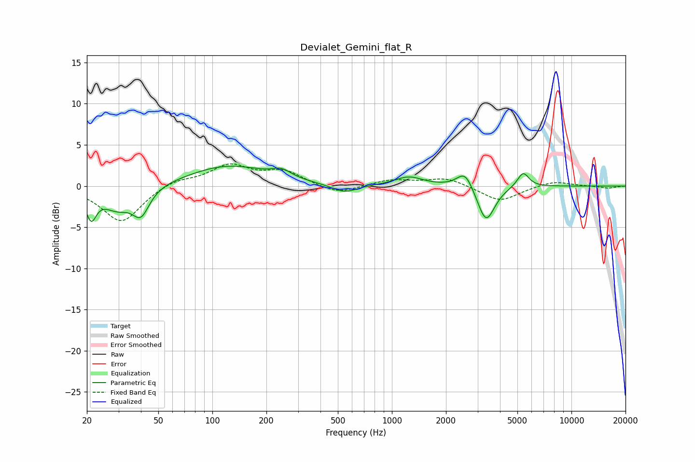

# Devialet_Gemini_flat_R
See [usage instructions](https://github.com/jaakkopasanen/AutoEq#usage) for more options and info.

### Parametric EQs
Apply preamp of -2.5 dB when using parametric equalizer.

|   # | Type    |   Fc (Hz) |    Q |   Gain (dB) |
|-----|---------|-----------|------|-------------|
|   1 | Peaking |        21 | 4.9  |        -3.2 |
|   2 | Peaking |        29 | 1.74 |        -2.5 |
|   3 | Peaking |        40 | 3.04 |        -3.1 |
|   4 | Peaking |       123 | 0.65 |         2.5 |
|   5 | Peaking |       243 | 2.7  |         0.9 |
|   6 | Peaking |       543 | 1.98 |        -1   |
|   7 | Peaking |      1242 | 1.79 |         1.1 |
|   8 | Peaking |      2557 | 3.13 |         2.2 |
|   9 | Peaking |      3342 | 2.93 |        -4.5 |
|  10 | Peaking |      5382 | 4.29 |         1.8 |

### Fixed Band EQs
When using fixed band (also called graphic) equalizer, apply preamp of **-2.8 dB** (if available) and set gains manually with these parameters.

|   # | Type    |   Fc (Hz) |    Q |   Gain (dB) |
|-----|---------|-----------|------|-------------|
|   1 | Peaking |        31 | 1.41 |        -4.4 |
|   2 | Peaking |        62 | 1.41 |         0.8 |
|   3 | Peaking |       125 | 1.41 |         2.4 |
|   4 | Peaking |       250 | 1.41 |         1.7 |
|   5 | Peaking |       500 | 1.41 |        -1.1 |
|   6 | Peaking |      1000 | 1.41 |         0.7 |
|   7 | Peaking |      2000 | 1.41 |         1   |
|   8 | Peaking |      4000 | 1.41 |        -1.9 |
|   9 | Peaking |      8000 | 1.41 |         0.6 |
|  10 | Peaking |     16000 | 1.41 |        -0.3 |

### Graphs

