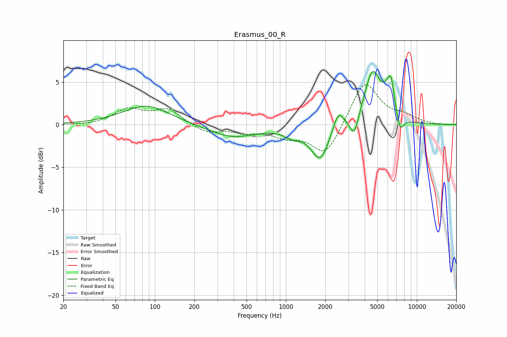

# Erasmus_00_R
See [usage instructions](https://github.com/jaakkopasanen/AutoEq#usage) for more options and info.

### Parametric EQs
Apply preamp of -6.3 dB when using parametric equalizer.

|   # | Type    |   Fc (Hz) |    Q |   Gain (dB) |
|-----|---------|-----------|------|-------------|
|   1 | Peaking |        86 | 0.8  |         2.3 |
|   2 | Peaking |       390 | 0.8  |        -1.5 |
|   3 | Peaking |      1128 | 2.19 |        -0.9 |
|   4 | Peaking |      1828 | 2.03 |        -4.1 |
|   5 | Peaking |      2507 | 3.65 |         2.2 |
|   6 | Peaking |      3332 | 4.33 |        -2.5 |
|   7 | Peaking |      4601 | 2.16 |         6.3 |
|   8 | Peaking |      5891 | 4.34 |         1.3 |
|   9 | Peaking |      6363 | 5.57 |         3.4 |
|  10 | Peaking |      7468 | 4.86 |        -1.9 |

### Fixed Band EQs
When using fixed band (also called graphic) equalizer, apply preamp of **-4.8 dB** (if available) and set gains manually with these parameters.

|   # | Type    |   Fc (Hz) |    Q |   Gain (dB) |
|-----|---------|-----------|------|-------------|
|   1 | Peaking |        31 | 1.41 |        -0.1 |
|   2 | Peaking |        62 | 1.41 |         1.7 |
|   3 | Peaking |       125 | 1.41 |         1.7 |
|   4 | Peaking |       250 | 1.41 |        -1   |
|   5 | Peaking |       500 | 1.41 |        -0.7 |
|   6 | Peaking |      1000 | 1.41 |        -1.2 |
|   7 | Peaking |      2000 | 1.41 |        -3.7 |
|   8 | Peaking |      4000 | 1.41 |         5.2 |
|   9 | Peaking |      8000 | 1.41 |         0.8 |
|  10 | Peaking |     16000 | 1.41 |        -0.1 |

### Graphs

