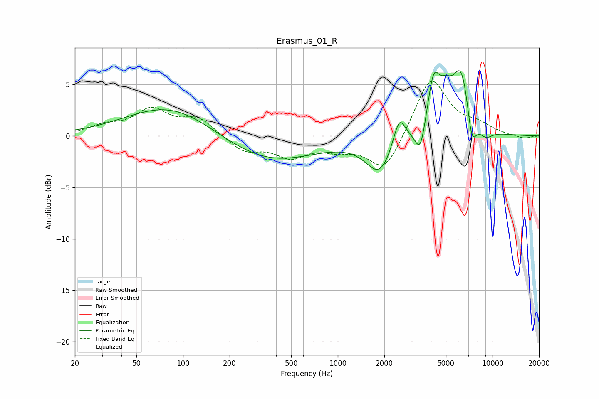

# Erasmus_01_R
See [usage instructions](https://github.com/jaakkopasanen/AutoEq#usage) for more options and info.

### Parametric EQs
Apply preamp of -6.4 dB when using parametric equalizer.

|   # | Type    |   Fc (Hz) |    Q |   Gain (dB) |
|-----|---------|-----------|------|-------------|
|   1 | Peaking |        83 | 0.51 |         3.1 |
|   2 | Peaking |       356 | 0.47 |        -2.6 |
|   3 | Peaking |      1869 | 1.61 |        -3.5 |
|   4 | Peaking |      2497 | 3.56 |         3   |
|   5 | Peaking |      3421 | 4.27 |        -2.9 |
|   6 | Peaking |      4164 | 3.45 |         5.1 |
|   7 | Peaking |      4979 | 3.45 |         1.9 |
|   8 | Peaking |      6316 | 2.16 |         6.7 |
|   9 | Peaking |      7331 | 4.17 |        -3.9 |
|  10 | Peaking |      8996 | 2.73 |        -1   |

### Fixed Band EQs
When using fixed band (also called graphic) equalizer, apply preamp of **-5.4 dB** (if available) and set gains manually with these parameters.

|   # | Type    |   Fc (Hz) |    Q |   Gain (dB) |
|-----|---------|-----------|------|-------------|
|   1 | Peaking |        31 | 1.41 |         0.8 |
|   2 | Peaking |        62 | 1.41 |         2.4 |
|   3 | Peaking |       125 | 1.41 |         1.6 |
|   4 | Peaking |       250 | 1.41 |        -1.5 |
|   5 | Peaking |       500 | 1.41 |        -1.8 |
|   6 | Peaking |      1000 | 1.41 |        -1   |
|   7 | Peaking |      2000 | 1.41 |        -3.5 |
|   8 | Peaking |      4000 | 1.41 |         5.8 |
|   9 | Peaking |      8000 | 1.41 |         0.9 |
|  10 | Peaking |     16000 | 1.41 |        -0.3 |

### Graphs

