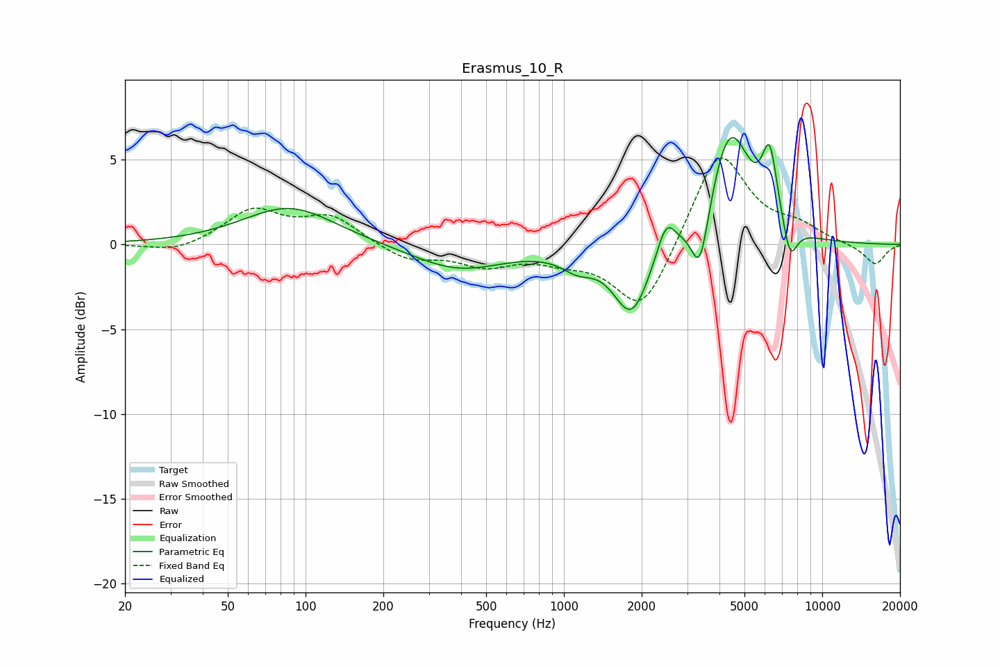

# Erasmus_10_R
See [usage instructions](https://github.com/jaakkopasanen/AutoEq#usage) for more options and info.

### Parametric EQs
Apply preamp of -6.4 dB when using parametric equalizer.

|   # | Type    |   Fc (Hz) |    Q |   Gain (dB) |
|-----|---------|-----------|------|-------------|
|   1 | Peaking |        87 | 0.8  |         2.2 |
|   2 | Peaking |       389 | 0.79 |        -1.5 |
|   3 | Peaking |      1128 | 2.2  |        -0.9 |
|   4 | Peaking |      1829 | 2.02 |        -4.2 |
|   5 | Peaking |      2486 | 4.04 |         1.9 |
|   6 | Peaking |      3364 | 4.22 |        -3.6 |
|   7 | Peaking |      4124 | 2.33 |         1   |
|   8 | Peaking |      4459 | 1.79 |         5.9 |
|   9 | Peaking |      6262 | 4.59 |         4.2 |
|  10 | Peaking |      7505 | 4.85 |        -2.2 |

### Fixed Band EQs
When using fixed band (also called graphic) equalizer, apply preamp of **-5.2 dB** (if available) and set gains manually with these parameters.

|   # | Type    |   Fc (Hz) |    Q |   Gain (dB) |
|-----|---------|-----------|------|-------------|
|   1 | Peaking |        31 | 1.41 |        -0.5 |
|   2 | Peaking |        62 | 1.41 |         2   |
|   3 | Peaking |       125 | 1.41 |         1.6 |
|   4 | Peaking |       250 | 1.41 |        -0.9 |
|   5 | Peaking |       500 | 1.41 |        -1.1 |
|   6 | Peaking |      1000 | 1.41 |        -0.7 |
|   7 | Peaking |      2000 | 1.41 |        -4.1 |
|   8 | Peaking |      4000 | 1.41 |         5.7 |
|   9 | Peaking |      8000 | 1.41 |         0.9 |
|  10 | Peaking |     16000 | 1.41 |        -1.2 |

### Graphs

