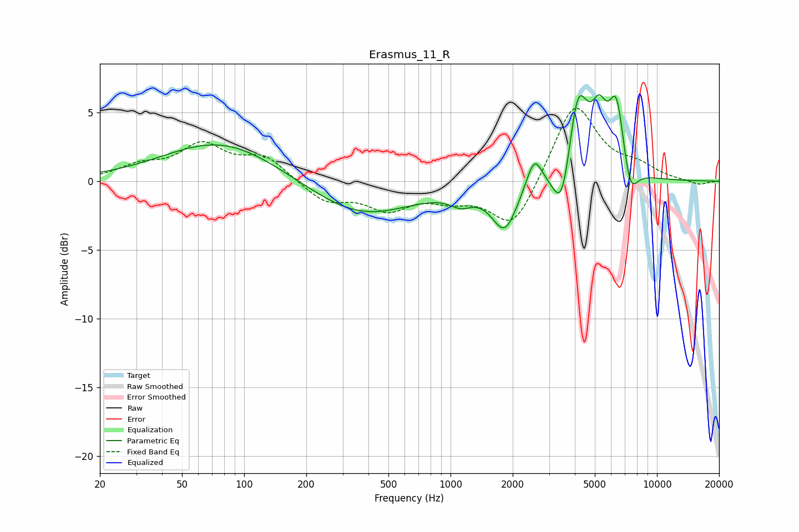

# Erasmus_11_R
See [usage instructions](https://github.com/jaakkopasanen/AutoEq#usage) for more options and info.

### Parametric EQs
Apply preamp of -6.4 dB when using parametric equalizer.

|   # | Type    |   Fc (Hz) |    Q |   Gain (dB) |
|-----|---------|-----------|------|-------------|
|   1 | Peaking |        78 | 0.51 |         2.9 |
|   2 | Peaking |       370 | 0.57 |        -2.6 |
|   3 | Peaking |      1122 | 2.57 |        -0.8 |
|   4 | Peaking |      1829 | 2.28 |        -3.4 |
|   5 | Peaking |      2545 | 3.77 |         2.3 |
|   6 | Peaking |      3481 | 3.15 |        -4.2 |
|   7 | Peaking |      4129 | 2.73 |         6.9 |
|   8 | Peaking |      5250 | 3.74 |         3.2 |
|   9 | Peaking |      6368 | 3.59 |         5.4 |
|  10 | Peaking |      7410 | 3.79 |        -2.5 |

### Fixed Band EQs
When using fixed band (also called graphic) equalizer, apply preamp of **-5.4 dB** (if available) and set gains manually with these parameters.

|   # | Type    |   Fc (Hz) |    Q |   Gain (dB) |
|-----|---------|-----------|------|-------------|
|   1 | Peaking |        31 | 1.41 |         1   |
|   2 | Peaking |        62 | 1.41 |         2.5 |
|   3 | Peaking |       125 | 1.41 |         1.7 |
|   4 | Peaking |       250 | 1.41 |        -1.5 |
|   5 | Peaking |       500 | 1.41 |        -1.8 |
|   6 | Peaking |      1000 | 1.41 |        -1   |
|   7 | Peaking |      2000 | 1.41 |        -3.6 |
|   8 | Peaking |      4000 | 1.41 |         5.8 |
|   9 | Peaking |      8000 | 1.41 |         0.9 |
|  10 | Peaking |     16000 | 1.41 |        -0.3 |

### Graphs

