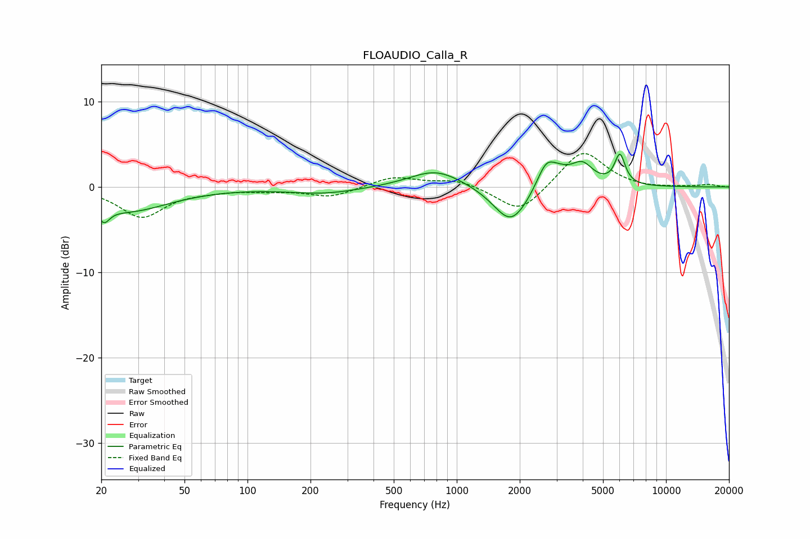

# FLOAUDIO_Calla_R
See [usage instructions](https://github.com/jaakkopasanen/AutoEq#usage) for more options and info.

### Parametric EQs
Apply preamp of -4.0 dB when using parametric equalizer.

|   # | Type    |   Fc (Hz) |    Q |   Gain (dB) |
|-----|---------|-----------|------|-------------|
|   1 | Peaking |        21 | 5.33 |        -1.7 |
|   2 | Peaking |        26 | 0.71 |        -2.8 |
|   3 | Peaking |       234 | 0.84 |        -0.8 |
|   4 | Peaking |       796 | 1.12 |         2.1 |
|   5 | Peaking |      1796 | 1.9  |        -1   |
|   6 | Peaking |      1825 | 1.65 |        -3.5 |
|   7 | Peaking |      2675 | 3.09 |         3   |
|   8 | Peaking |      3107 | 2.52 |         1.1 |
|   9 | Peaking |      3973 | 2.65 |         2.4 |
|  10 | Peaking |      6020 | 5.51 |         3.5 |

### Fixed Band EQs
When using fixed band (also called graphic) equalizer, apply preamp of **-4.0 dB** (if available) and set gains manually with these parameters.

|   # | Type    |   Fc (Hz) |    Q |   Gain (dB) |
|-----|---------|-----------|------|-------------|
|   1 | Peaking |        31 | 1.41 |        -3.5 |
|   2 | Peaking |        62 | 1.41 |        -0.3 |
|   3 | Peaking |       125 | 1.41 |        -0.3 |
|   4 | Peaking |       250 | 1.41 |        -1.2 |
|   5 | Peaking |       500 | 1.41 |         1.2 |
|   6 | Peaking |      1000 | 1.41 |         0.9 |
|   7 | Peaking |      2000 | 1.41 |        -3.2 |
|   8 | Peaking |      4000 | 1.41 |         4.5 |
|   9 | Peaking |      8000 | 1.41 |        -0.2 |
|  10 | Peaking |     16000 | 1.41 |         0.3 |

### Graphs

