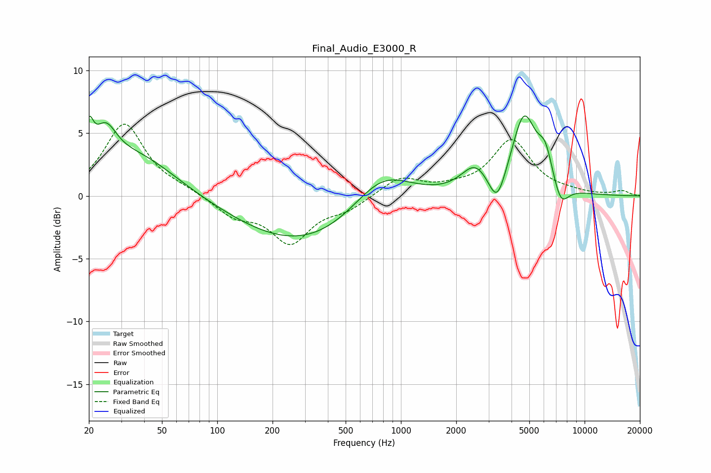

# Final_Audio_E3000_R
See [usage instructions](https://github.com/jaakkopasanen/AutoEq#usage) for more options and info.

### Parametric EQs
Apply preamp of -6.5 dB when using parametric equalizer.

|   # | Type    |   Fc (Hz) |    Q |   Gain (dB) |
|-----|---------|-----------|------|-------------|
|   1 | Peaking |        20 | 5.99 |         2.9 |
|   2 | Peaking |        25 | 2.31 |         3.1 |
|   3 | Peaking |        36 | 0.65 |         3.2 |
|   4 | Peaking |       304 | 0.38 |        -3.9 |
|   5 | Peaking |       783 | 0.86 |         3.3 |
|   6 | Peaking |      2532 | 1.9  |         2.1 |
|   7 | Peaking |      3336 | 3.1  |        -2.6 |
|   8 | Peaking |      4675 | 2.08 |         6.2 |
|   9 | Peaking |      6108 | 3.33 |         2.4 |
|  10 | Peaking |      7414 | 3.19 |        -1.8 |

### Fixed Band EQs
When using fixed band (also called graphic) equalizer, apply preamp of **-5.8 dB** (if available) and set gains manually with these parameters.

|   # | Type    |   Fc (Hz) |    Q |   Gain (dB) |
|-----|---------|-----------|------|-------------|
|   1 | Peaking |        31 | 1.41 |         5.7 |
|   2 | Peaking |        62 | 1.41 |         0.4 |
|   3 | Peaking |       125 | 1.41 |        -1.5 |
|   4 | Peaking |       250 | 1.41 |        -3.6 |
|   5 | Peaking |       500 | 1.41 |        -0.9 |
|   6 | Peaking |      1000 | 1.41 |         1.5 |
|   7 | Peaking |      2000 | 1.41 |         0.4 |
|   8 | Peaking |      4000 | 1.41 |         4.4 |
|   9 | Peaking |      8000 | 1.41 |         0.2 |
|  10 | Peaking |     16000 | 1.41 |         0.4 |

### Graphs

