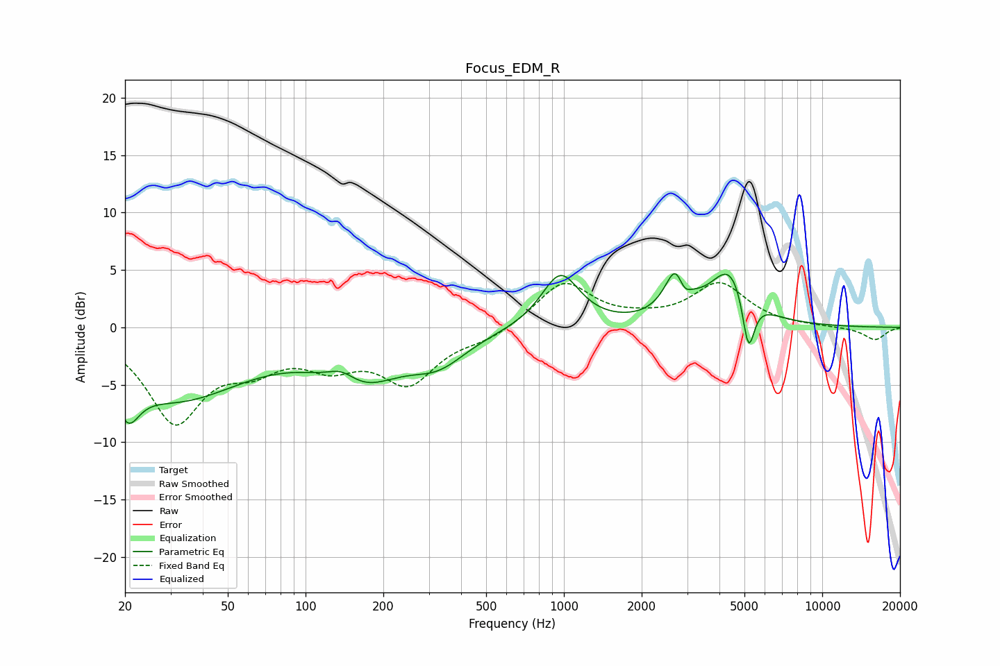

# Focus_EDM_R
See [usage instructions](https://github.com/jaakkopasanen/AutoEq#usage) for more options and info.

### Parametric EQs
Apply preamp of -4.8 dB when using parametric equalizer.

|   # | Type    |   Fc (Hz) |    Q |   Gain (dB) |
|-----|---------|-----------|------|-------------|
|   1 | Peaking |        21 | 3.31 |        -3.3 |
|   2 | Peaking |        32 | 0.52 |        -6   |
|   3 | Peaking |       138 | 2.52 |         1.2 |
|   4 | Peaking |       163 | 0.91 |        -4.1 |
|   5 | Peaking |       327 | 1.28 |        -2.4 |
|   6 | Peaking |       969 | 1.92 |         4.7 |
|   7 | Peaking |      2766 | 3.34 |         5.8 |
|   8 | Peaking |      2885 | 4.78 |        -3   |
|   9 | Peaking |      4429 | 1.79 |         5   |
|  10 | Peaking |      5180 | 5.83 |        -5.2 |

### Fixed Band EQs
When using fixed band (also called graphic) equalizer, apply preamp of **-4.0 dB** (if available) and set gains manually with these parameters.

|   # | Type    |   Fc (Hz) |    Q |   Gain (dB) |
|-----|---------|-----------|------|-------------|
|   1 | Peaking |        31 | 1.41 |        -7.9 |
|   2 | Peaking |        62 | 1.41 |        -2.6 |
|   3 | Peaking |       125 | 1.41 |        -2.6 |
|   4 | Peaking |       250 | 1.41 |        -4.5 |
|   5 | Peaking |       500 | 1.41 |        -0.9 |
|   6 | Peaking |      1000 | 1.41 |         4   |
|   7 | Peaking |      2000 | 1.41 |         0.4 |
|   8 | Peaking |      4000 | 1.41 |         3.7 |
|   9 | Peaking |      8000 | 1.41 |         0   |
|  10 | Peaking |     16000 | 1.41 |        -1.1 |

### Graphs

