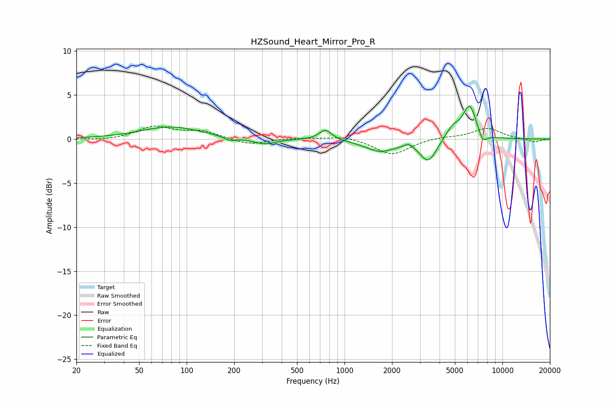

# HZSound_Heart_Mirror_Pro_R
See [usage instructions](https://github.com/jaakkopasanen/AutoEq#usage) for more options and info.

### Parametric EQs
Apply preamp of -3.8 dB when using parametric equalizer.

|   # | Type    |   Fc (Hz) |    Q |   Gain (dB) |
|-----|---------|-----------|------|-------------|
|   1 | Peaking |        79 | 0.76 |         1.4 |
|   2 | Peaking |       188 | 3.87 |        -0.4 |
|   3 | Peaking |       311 | 1.93 |        -0.7 |
|   4 | Peaking |       756 | 3.57 |         1.2 |
|   5 | Peaking |      1686 | 1.45 |        -1.3 |
|   6 | Peaking |      2549 | 5.29 |         0.4 |
|   7 | Peaking |      3397 | 2.71 |        -2.5 |
|   8 | Peaking |      4864 | 3.02 |         1.3 |
|   9 | Peaking |      6205 | 3.22 |         3.8 |
|  10 | Peaking |      7515 | 4.85 |        -1.2 |

### Fixed Band EQs
When using fixed band (also called graphic) equalizer, apply preamp of **-1.6 dB** (if available) and set gains manually with these parameters.

|   # | Type    |   Fc (Hz) |    Q |   Gain (dB) |
|-----|---------|-----------|------|-------------|
|   1 | Peaking |        31 | 1.41 |        -0.2 |
|   2 | Peaking |        62 | 1.41 |         1.4 |
|   3 | Peaking |       125 | 1.41 |         0.8 |
|   4 | Peaking |       250 | 1.41 |        -0.7 |
|   5 | Peaking |       500 | 1.41 |         0.1 |
|   6 | Peaking |      1000 | 1.41 |         0.4 |
|   7 | Peaking |      2000 | 1.41 |        -1.8 |
|   8 | Peaking |      4000 | 1.41 |         0.2 |
|   9 | Peaking |      8000 | 1.41 |         1.2 |
|  10 | Peaking |     16000 | 1.41 |        -0.4 |

### Graphs

