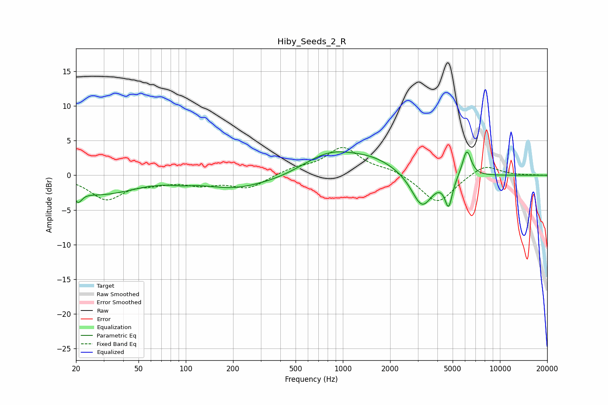

# Hiby_Seeds_2_R
See [usage instructions](https://github.com/jaakkopasanen/AutoEq#usage) for more options and info.

### Parametric EQs
Apply preamp of -3.5 dB when using parametric equalizer.

|   # | Type    |   Fc (Hz) |    Q |   Gain (dB) |
|-----|---------|-----------|------|-------------|
|   1 | Peaking |        21 | 5.71 |        -1.6 |
|   2 | Peaking |        28 | 0.64 |        -2.6 |
|   3 | Peaking |        95 | 2.08 |        -0.4 |
|   4 | Peaking |       198 | 0.78 |        -1.6 |
|   5 | Peaking |       375 | 0.75 |        -0.7 |
|   6 | Peaking |       821 | 0.81 |         3   |
|   7 | Peaking |      1577 | 0.87 |         1.8 |
|   8 | Peaking |      3190 | 2.12 |        -5   |
|   9 | Peaking |      4716 | 5.87 |        -4.1 |
|  10 | Peaking |      6152 | 4.89 |         3.9 |

### Fixed Band EQs
When using fixed band (also called graphic) equalizer, apply preamp of **-4.1 dB** (if available) and set gains manually with these parameters.

|   # | Type    |   Fc (Hz) |    Q |   Gain (dB) |
|-----|---------|-----------|------|-------------|
|   1 | Peaking |        31 | 1.41 |        -3.3 |
|   2 | Peaking |        62 | 1.41 |        -0.8 |
|   3 | Peaking |       125 | 1.41 |        -1.1 |
|   4 | Peaking |       250 | 1.41 |        -1.8 |
|   5 | Peaking |       500 | 1.41 |         0.9 |
|   6 | Peaking |      1000 | 1.41 |         3.9 |
|   7 | Peaking |      2000 | 1.41 |         0.8 |
|   8 | Peaking |      4000 | 1.41 |        -4.1 |
|   9 | Peaking |      8000 | 1.41 |         1.7 |
|  10 | Peaking |     16000 | 1.41 |         0   |

### Graphs

