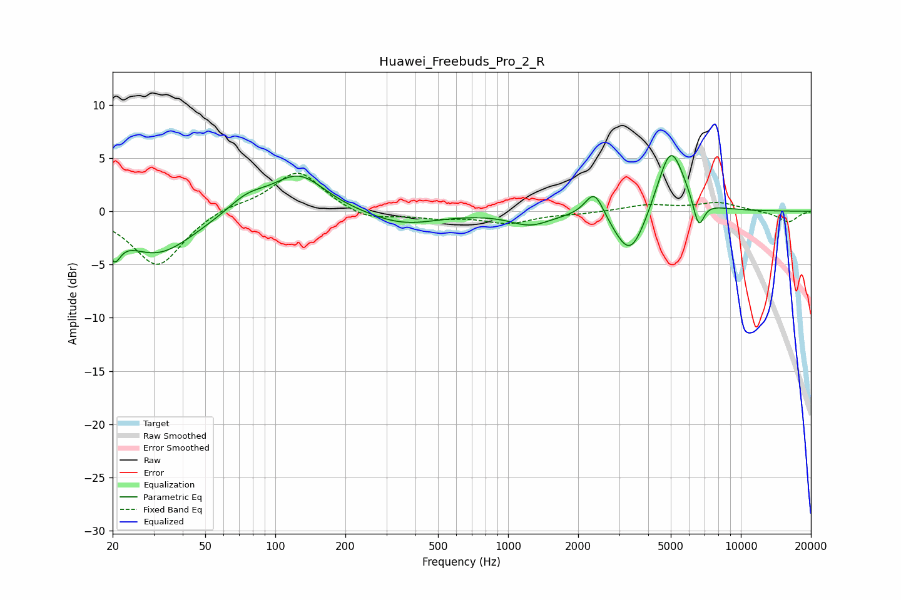

# Huawei_Freebuds_Pro_2_R
See [usage instructions](https://github.com/jaakkopasanen/AutoEq#usage) for more options and info.

### Parametric EQs
Apply preamp of -5.3 dB when using parametric equalizer.

|   # | Type    |   Fc (Hz) |    Q |   Gain (dB) |
|-----|---------|-----------|------|-------------|
|   1 | Peaking |        20 | 5.48 |        -2.4 |
|   2 | Peaking |        31 | 0.9  |        -4   |
|   3 | Peaking |        76 | 1.67 |         1.4 |
|   4 | Peaking |       126 | 1.24 |         3.5 |
|   5 | Peaking |       353 | 0.94 |        -1.3 |
|   6 | Peaking |      1245 | 1.65 |        -1.2 |
|   7 | Peaking |      2352 | 3.47 |         2.7 |
|   8 | Peaking |      3355 | 2.02 |        -4.8 |
|   9 | Peaking |      4996 | 2.31 |         6.6 |
|  10 | Peaking |      6586 | 5.73 |        -2.8 |

### Fixed Band EQs
When using fixed band (also called graphic) equalizer, apply preamp of **-3.7 dB** (if available) and set gains manually with these parameters.

|   # | Type    |   Fc (Hz) |    Q |   Gain (dB) |
|-----|---------|-----------|------|-------------|
|   1 | Peaking |        31 | 1.41 |        -5.2 |
|   2 | Peaking |        62 | 1.41 |         0.6 |
|   3 | Peaking |       125 | 1.41 |         3.8 |
|   4 | Peaking |       250 | 1.41 |        -0.9 |
|   5 | Peaking |       500 | 1.41 |        -0.5 |
|   6 | Peaking |      1000 | 1.41 |        -1   |
|   7 | Peaking |      2000 | 1.41 |        -0.2 |
|   8 | Peaking |      4000 | 1.41 |         0.6 |
|   9 | Peaking |      8000 | 1.41 |         0.8 |
|  10 | Peaking |     16000 | 1.41 |        -1   |

### Graphs

