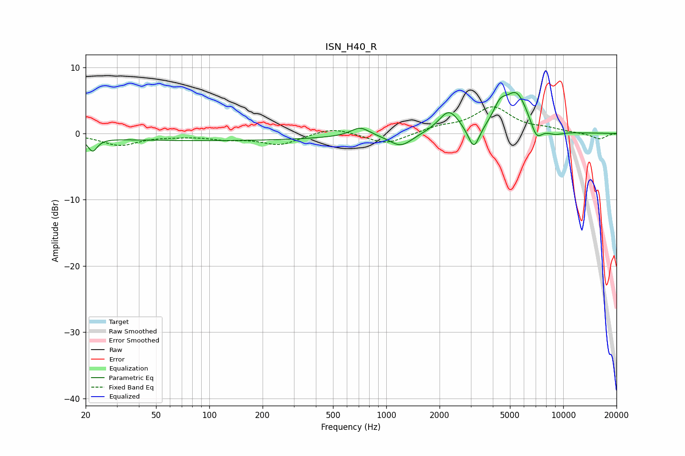

# ISN_H40_R
See [usage instructions](https://github.com/jaakkopasanen/AutoEq#usage) for more options and info.

### Parametric EQs
Apply preamp of -6.3 dB when using parametric equalizer.

|   # | Type    |   Fc (Hz) |    Q |   Gain (dB) |
|-----|---------|-----------|------|-------------|
|   1 | Peaking |        22 | 5.44 |        -2   |
|   2 | Peaking |        98 | 0.18 |        -1.1 |
|   3 | Peaking |       712 | 2.71 |         1.4 |
|   4 | Peaking |      1209 | 2.18 |        -2   |
|   5 | Peaking |      2260 | 2.46 |         3.4 |
|   6 | Peaking |      3125 | 4.39 |        -3.6 |
|   7 | Peaking |      4389 | 3.66 |         2.5 |
|   8 | Peaking |      5449 | 2.04 |         5.9 |
|   9 | Peaking |      7056 | 4.02 |        -2.5 |
|  10 | Peaking |      8954 | 2.52 |        -0.7 |

### Fixed Band EQs
When using fixed band (also called graphic) equalizer, apply preamp of **-4.1 dB** (if available) and set gains manually with these parameters.

|   # | Type    |   Fc (Hz) |    Q |   Gain (dB) |
|-----|---------|-----------|------|-------------|
|   1 | Peaking |        31 | 1.41 |        -1.7 |
|   2 | Peaking |        62 | 1.41 |        -0.2 |
|   3 | Peaking |       125 | 1.41 |        -0.7 |
|   4 | Peaking |       250 | 1.41 |        -1.6 |
|   5 | Peaking |       500 | 1.41 |         1   |
|   6 | Peaking |      1000 | 1.41 |        -1.7 |
|   7 | Peaking |      2000 | 1.41 |         0.8 |
|   8 | Peaking |      4000 | 1.41 |         3.9 |
|   9 | Peaking |      8000 | 1.41 |         0.6 |
|  10 | Peaking |     16000 | 1.41 |        -0.9 |

### Graphs

