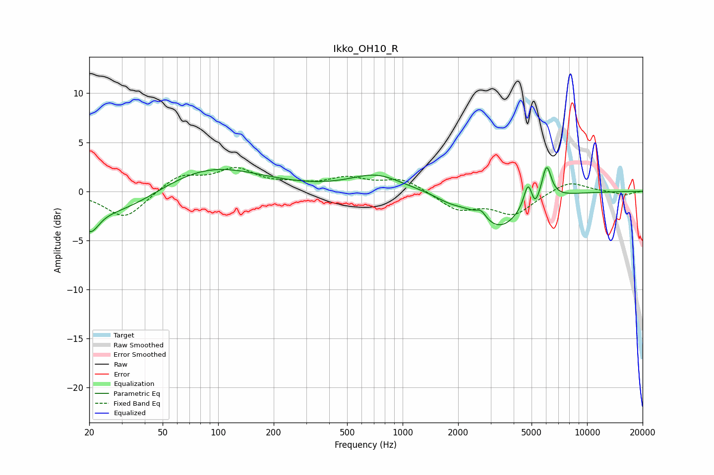

# Ikko_OH10_R
See [usage instructions](https://github.com/jaakkopasanen/AutoEq#usage) for more options and info.

### Parametric EQs
Apply preamp of -2.5 dB when using parametric equalizer.

|   # | Type    |   Fc (Hz) |    Q |   Gain (dB) |
|-----|---------|-----------|------|-------------|
|   1 | Peaking |        20 | 3.03 |        -2.5 |
|   2 | Peaking |        29 | 0.6  |        -2.6 |
|   3 | Peaking |        86 | 0.5  |         2.9 |
|   4 | Peaking |       719 | 1.01 |         1.6 |
|   5 | Peaking |      1791 | 1.85 |        -0.6 |
|   6 | Peaking |      2664 | 5.64 |         0.7 |
|   7 | Peaking |      3361 | 1.18 |        -3.7 |
|   8 | Peaking |      4796 | 6    |         2.6 |
|   9 | Peaking |      5206 | 6    |        -1.3 |
|  10 | Peaking |      6032 | 5.38 |         3.5 |

### Fixed Band EQs
When using fixed band (also called graphic) equalizer, apply preamp of **-2.5 dB** (if available) and set gains manually with these parameters.

|   # | Type    |   Fc (Hz) |    Q |   Gain (dB) |
|-----|---------|-----------|------|-------------|
|   1 | Peaking |        31 | 1.41 |        -2.8 |
|   2 | Peaking |        62 | 1.41 |         1.6 |
|   3 | Peaking |       125 | 1.41 |         2.1 |
|   4 | Peaking |       250 | 1.41 |         0.5 |
|   5 | Peaking |       500 | 1.41 |         1.2 |
|   6 | Peaking |      1000 | 1.41 |         1.3 |
|   7 | Peaking |      2000 | 1.41 |        -1.8 |
|   8 | Peaking |      4000 | 1.41 |        -2.3 |
|   9 | Peaking |      8000 | 1.41 |         1.1 |
|  10 | Peaking |     16000 | 1.41 |        -0.4 |

### Graphs

