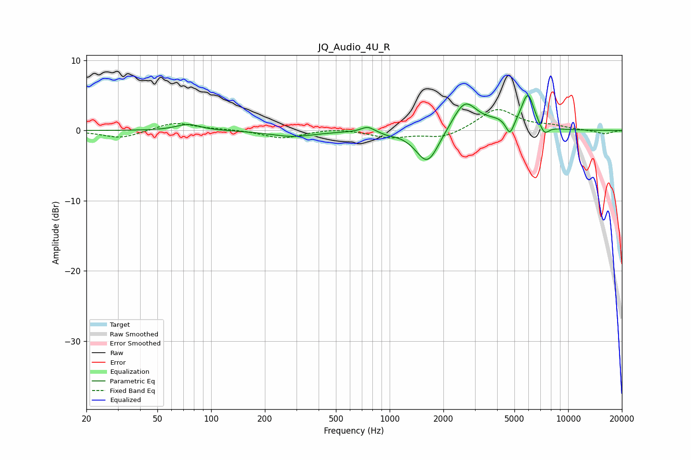

# JQ_Audio_4U_R
See [usage instructions](https://github.com/jaakkopasanen/AutoEq#usage) for more options and info.

### Parametric EQs
Apply preamp of -5.0 dB when using parametric equalizer.

|   # | Type    |   Fc (Hz) |    Q |   Gain (dB) |
|-----|---------|-----------|------|-------------|
|   1 | Peaking |        74 | 2.12 |         0.9 |
|   2 | Peaking |       286 | 1.16 |        -0.8 |
|   3 | Peaking |       753 | 3.88 |         0.8 |
|   4 | Peaking |       980 | 3.96 |        -0.2 |
|   5 | Peaking |      1629 | 2.18 |        -5   |
|   6 | Peaking |      2636 | 2.06 |         4.3 |
|   7 | Peaking |      4088 | 1.83 |         1   |
|   8 | Peaking |      4718 | 6    |        -2.3 |
|   9 | Peaking |      5946 | 3.82 |         4.9 |
|  10 | Peaking |      7347 | 5.18 |        -1.4 |

### Fixed Band EQs
When using fixed band (also called graphic) equalizer, apply preamp of **-3.1 dB** (if available) and set gains manually with these parameters.

|   # | Type    |   Fc (Hz) |    Q |   Gain (dB) |
|-----|---------|-----------|------|-------------|
|   1 | Peaking |        31 | 1.41 |        -1.1 |
|   2 | Peaking |        62 | 1.41 |         1.2 |
|   3 | Peaking |       125 | 1.41 |         0.2 |
|   4 | Peaking |       250 | 1.41 |        -1.1 |
|   5 | Peaking |       500 | 1.41 |         0.4 |
|   6 | Peaking |      1000 | 1.41 |        -1   |
|   7 | Peaking |      2000 | 1.41 |        -1.1 |
|   8 | Peaking |      4000 | 1.41 |         3.1 |
|   9 | Peaking |      8000 | 1.41 |         0.5 |
|  10 | Peaking |     16000 | 1.41 |        -0.5 |

### Graphs

