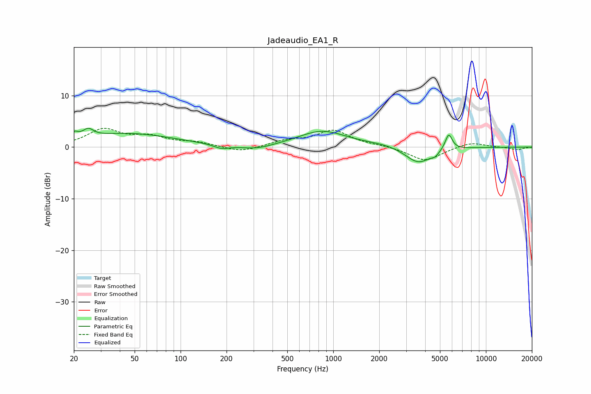

# Jadeaudio_EA1_R
See [usage instructions](https://github.com/jaakkopasanen/AutoEq#usage) for more options and info.

### Parametric EQs
Apply preamp of -3.7 dB when using parametric equalizer.

|   # | Type    |   Fc (Hz) |    Q |   Gain (dB) |
|-----|---------|-----------|------|-------------|
|   1 | Peaking |        20 | 5.57 |         1.2 |
|   2 | Peaking |        25 | 4.15 |         1.5 |
|   3 | Peaking |        45 | 0.46 |         2.6 |
|   4 | Peaking |       185 | 2.71 |        -0.8 |
|   5 | Peaking |       313 | 1.36 |        -0.9 |
|   6 | Peaking |       843 | 0.91 |         3.1 |
|   7 | Peaking |      2211 | 0.89 |         0.5 |
|   8 | Peaking |      3602 | 1.61 |        -3.3 |
|   9 | Peaking |      4653 | 6    |        -0.7 |
|  10 | Peaking |      5706 | 5.95 |         3.1 |

### Fixed Band EQs
When using fixed band (also called graphic) equalizer, apply preamp of **-3.7 dB** (if available) and set gains manually with these parameters.

|   # | Type    |   Fc (Hz) |    Q |   Gain (dB) |
|-----|---------|-----------|------|-------------|
|   1 | Peaking |        31 | 1.41 |         3.3 |
|   2 | Peaking |        62 | 1.41 |         1.8 |
|   3 | Peaking |       125 | 1.41 |         0.8 |
|   4 | Peaking |       250 | 1.41 |        -1.1 |
|   5 | Peaking |       500 | 1.41 |         1.1 |
|   6 | Peaking |      1000 | 1.41 |         3.1 |
|   7 | Peaking |      2000 | 1.41 |         0.3 |
|   8 | Peaking |      4000 | 1.41 |        -2.7 |
|   9 | Peaking |      8000 | 1.41 |         1   |
|  10 | Peaking |     16000 | 1.41 |        -0.5 |

### Graphs

