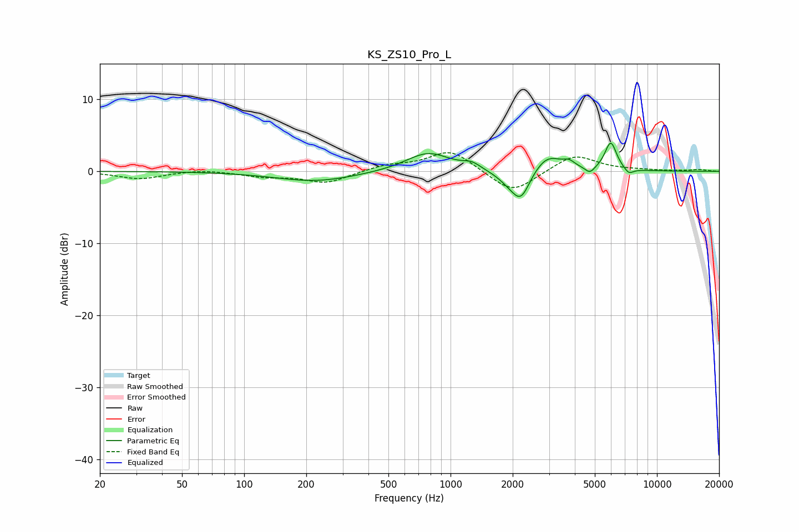

# KS_ZS10_Pro_L
See [usage instructions](https://github.com/jaakkopasanen/AutoEq#usage) for more options and info.

### Parametric EQs
Apply preamp of -4.0 dB when using parametric equalizer.

|   # | Type    |   Fc (Hz) |    Q |   Gain (dB) |
|-----|---------|-----------|------|-------------|
|   1 | Peaking |       222 | 0.73 |        -1.4 |
|   2 | Peaking |       778 | 1.31 |         2.7 |
|   3 | Peaking |      1265 | 3.36 |         0.8 |
|   4 | Peaking |      1917 | 2.4  |        -1.2 |
|   5 | Peaking |      2194 | 3.15 |        -3.8 |
|   6 | Peaking |      2941 | 2.01 |         2.4 |
|   7 | Peaking |      3750 | 5.18 |         0.7 |
|   8 | Peaking |      4734 | 6    |        -1   |
|   9 | Peaking |      5971 | 4.89 |         3.9 |
|  10 | Peaking |      7300 | 6    |        -0.8 |

### Fixed Band EQs
When using fixed band (also called graphic) equalizer, apply preamp of **-2.7 dB** (if available) and set gains manually with these parameters.

|   # | Type    |   Fc (Hz) |    Q |   Gain (dB) |
|-----|---------|-----------|------|-------------|
|   1 | Peaking |        31 | 1.41 |        -1   |
|   2 | Peaking |        62 | 1.41 |         0.3 |
|   3 | Peaking |       125 | 1.41 |        -0.7 |
|   4 | Peaking |       250 | 1.41 |        -1.6 |
|   5 | Peaking |       500 | 1.41 |         0.8 |
|   6 | Peaking |      1000 | 1.41 |         3   |
|   7 | Peaking |      2000 | 1.41 |        -3.2 |
|   8 | Peaking |      4000 | 1.41 |         2.4 |
|   9 | Peaking |      8000 | 1.41 |         0.1 |
|  10 | Peaking |     16000 | 1.41 |         0.2 |

### Graphs

