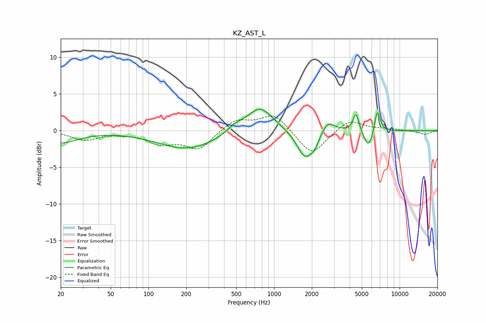

# KZ_AST_L
See [usage instructions](https://github.com/jaakkopasanen/AutoEq#usage) for more options and info.

### Parametric EQs
Apply preamp of -3.0 dB when using parametric equalizer.

|   # | Type    |   Fc (Hz) |    Q |   Gain (dB) |
|-----|---------|-----------|------|-------------|
|   1 | Peaking |        20 | 1.06 |        -1.6 |
|   2 | Peaking |       206 | 0.61 |        -2.5 |
|   3 | Peaking |       488 | 2.31 |         0.8 |
|   4 | Peaking |       772 | 1.34 |         3.4 |
|   5 | Peaking |      1777 | 2.13 |        -3.9 |
|   6 | Peaking |      2132 | 4.49 |        -1   |
|   7 | Peaking |      2681 | 2.57 |         1.7 |
|   8 | Peaking |      4501 | 6    |         2.6 |
|   9 | Peaking |      5661 | 3.74 |        -2.5 |
|  10 | Peaking |      6649 | 5.99 |         3.2 |

### Fixed Band EQs
When using fixed band (also called graphic) equalizer, apply preamp of **-2.1 dB** (if available) and set gains manually with these parameters.

|   # | Type    |   Fc (Hz) |    Q |   Gain (dB) |
|-----|---------|-----------|------|-------------|
|   1 | Peaking |        31 | 1.41 |        -1.2 |
|   2 | Peaking |        62 | 1.41 |        -0.2 |
|   3 | Peaking |       125 | 1.41 |        -1.6 |
|   4 | Peaking |       250 | 1.41 |        -2.5 |
|   5 | Peaking |       500 | 1.41 |         1.6 |
|   6 | Peaking |      1000 | 1.41 |         2.3 |
|   7 | Peaking |      2000 | 1.41 |        -3.5 |
|   8 | Peaking |      4000 | 1.41 |         1.6 |
|   9 | Peaking |      8000 | 1.41 |         0.2 |
|  10 | Peaking |     16000 | 1.41 |        -0.5 |

### Graphs

