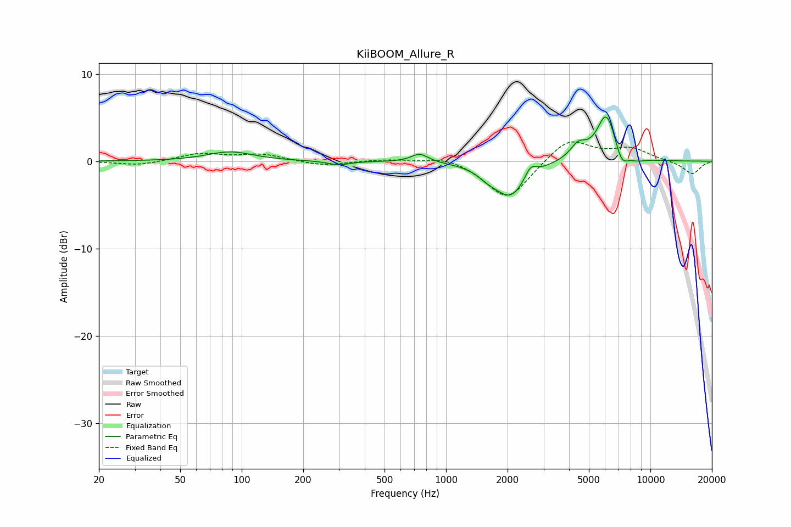

# KiiBOOM_Allure_R
See [usage instructions](https://github.com/jaakkopasanen/AutoEq#usage) for more options and info.

### Parametric EQs
Apply preamp of -5.2 dB when using parametric equalizer.

|   # | Type    |   Fc (Hz) |    Q |   Gain (dB) |
|-----|---------|-----------|------|-------------|
|   1 | Peaking |        88 | 1.27 |         1.1 |
|   2 | Peaking |       298 | 2.69 |        -0.5 |
|   3 | Peaking |       743 | 3.41 |         1   |
|   4 | Peaking |      1603 | 2.89 |        -0.8 |
|   5 | Peaking |      2067 | 1.84 |        -3.9 |
|   6 | Peaking |      2591 | 5.17 |         1.3 |
|   7 | Peaking |      4441 | 3.42 |         1.7 |
|   8 | Peaking |      6093 | 2.95 |         5.4 |
|   9 | Peaking |      7237 | 4.37 |        -1.8 |
|  10 | Peaking |      8597 | 3.19 |        -0.3 |

### Fixed Band EQs
When using fixed band (also called graphic) equalizer, apply preamp of **-2.3 dB** (if available) and set gains manually with these parameters.

|   # | Type    |   Fc (Hz) |    Q |   Gain (dB) |
|-----|---------|-----------|------|-------------|
|   1 | Peaking |        31 | 1.41 |        -0.5 |
|   2 | Peaking |        62 | 1.41 |         0.9 |
|   3 | Peaking |       125 | 1.41 |         0.8 |
|   4 | Peaking |       250 | 1.41 |        -0.6 |
|   5 | Peaking |       500 | 1.41 |         0.2 |
|   6 | Peaking |      1000 | 1.41 |         0.7 |
|   7 | Peaking |      2000 | 1.41 |        -4.5 |
|   8 | Peaking |      4000 | 1.41 |         2.7 |
|   9 | Peaking |      8000 | 1.41 |         1.4 |
|  10 | Peaking |     16000 | 1.41 |        -1.5 |

### Graphs

