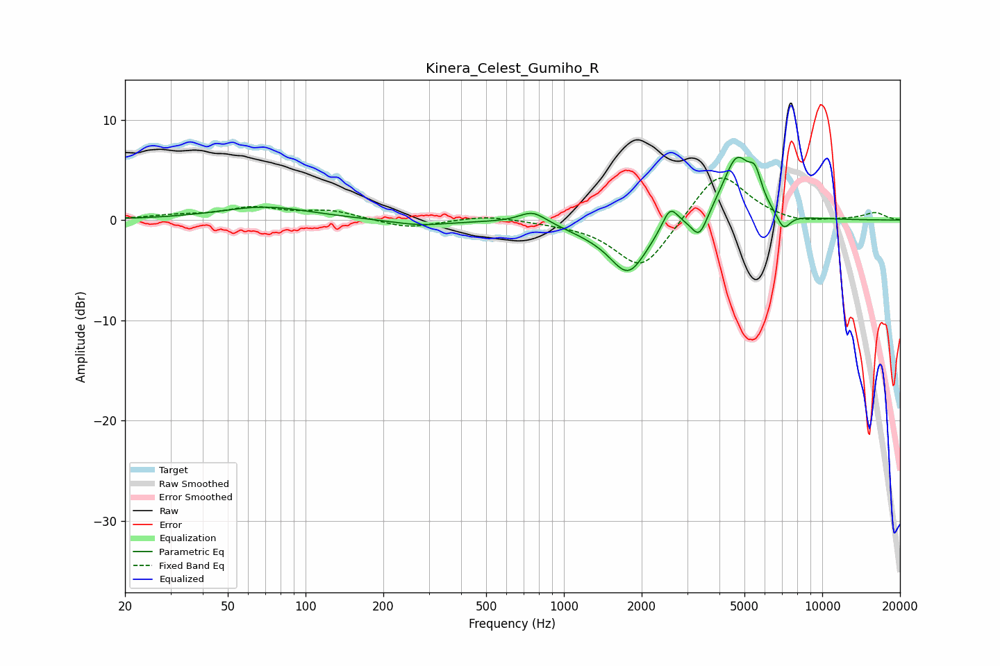

# Kinera_Celest_Gumiho_R
See [usage instructions](https://github.com/jaakkopasanen/AutoEq#usage) for more options and info.

### Parametric EQs
Apply preamp of -6.4 dB when using parametric equalizer.

|   # | Type    |   Fc (Hz) |    Q |   Gain (dB) |
|-----|---------|-----------|------|-------------|
|   1 | Peaking |        70 | 0.79 |         1.3 |
|   2 | Peaking |       276 | 1.25 |        -0.6 |
|   3 | Peaking |       757 | 2.71 |         1.2 |
|   4 | Peaking |      1258 | 1.37 |        -0.7 |
|   5 | Peaking |      1777 | 1.94 |        -5   |
|   6 | Peaking |      2576 | 4.65 |         2.3 |
|   7 | Peaking |      3346 | 4.62 |        -2.4 |
|   8 | Peaking |      4675 | 2.45 |         6.3 |
|   9 | Peaking |      5506 | 5.87 |         2.4 |
|  10 | Peaking |      7082 | 5.08 |        -1.7 |

### Fixed Band EQs
When using fixed band (also called graphic) equalizer, apply preamp of **-4.3 dB** (if available) and set gains manually with these parameters.

|   # | Type    |   Fc (Hz) |    Q |   Gain (dB) |
|-----|---------|-----------|------|-------------|
|   1 | Peaking |        31 | 1.41 |         0.4 |
|   2 | Peaking |        62 | 1.41 |         1.1 |
|   3 | Peaking |       125 | 1.41 |         0.9 |
|   4 | Peaking |       250 | 1.41 |        -0.8 |
|   5 | Peaking |       500 | 1.41 |         0.5 |
|   6 | Peaking |      1000 | 1.41 |        -0.2 |
|   7 | Peaking |      2000 | 1.41 |        -5.1 |
|   8 | Peaking |      4000 | 1.41 |         5.1 |
|   9 | Peaking |      8000 | 1.41 |        -0.5 |
|  10 | Peaking |     16000 | 1.41 |         0.7 |

### Graphs

