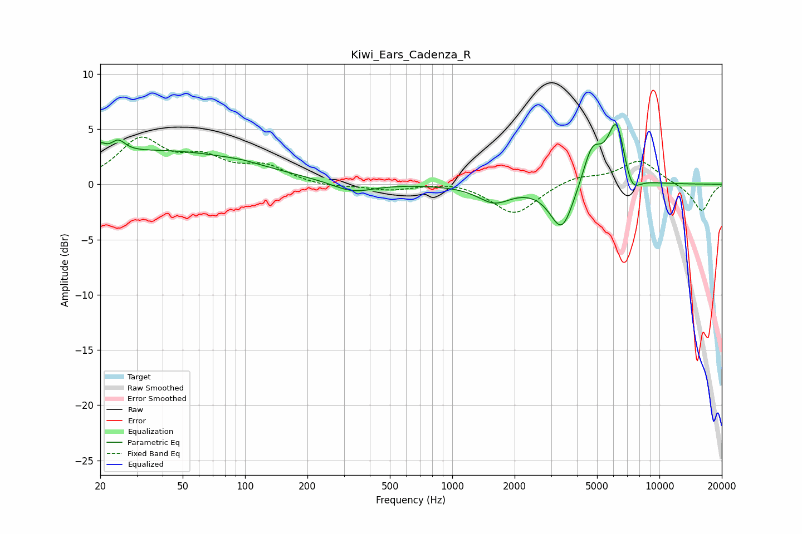

# Kiwi_Ears_Cadenza_R
See [usage instructions](https://github.com/jaakkopasanen/AutoEq#usage) for more options and info.

### Parametric EQs
Apply preamp of -5.5 dB when using parametric equalizer.

|   # | Type    |   Fc (Hz) |    Q |   Gain (dB) |
|-----|---------|-----------|------|-------------|
|   1 | Peaking |        20 | 6    |         0.9 |
|   2 | Peaking |        24 | 4.12 |         1.1 |
|   3 | Peaking |        39 | 0.31 |         3   |
|   4 | Peaking |        97 | 1.88 |         0.1 |
|   5 | Peaking |       331 | 1.42 |        -0.9 |
|   6 | Peaking |      1595 | 1.77 |        -1.5 |
|   7 | Peaking |      3384 | 2.43 |        -4.3 |
|   8 | Peaking |      4739 | 3.04 |         3.4 |
|   9 | Peaking |      6211 | 3.16 |         5.8 |
|  10 | Peaking |      7300 | 3.32 |        -2.1 |

### Fixed Band EQs
When using fixed band (also called graphic) equalizer, apply preamp of **-4.4 dB** (if available) and set gains manually with these parameters.

|   # | Type    |   Fc (Hz) |    Q |   Gain (dB) |
|-----|---------|-----------|------|-------------|
|   1 | Peaking |        31 | 1.41 |         3.9 |
|   2 | Peaking |        62 | 1.41 |         2   |
|   3 | Peaking |       125 | 1.41 |         1.5 |
|   4 | Peaking |       250 | 1.41 |        -0.3 |
|   5 | Peaking |       500 | 1.41 |        -0.5 |
|   6 | Peaking |      1000 | 1.41 |         0.3 |
|   7 | Peaking |      2000 | 1.41 |        -2.8 |
|   8 | Peaking |      4000 | 1.41 |         0.7 |
|   9 | Peaking |      8000 | 1.41 |         2.2 |
|  10 | Peaking |     16000 | 1.41 |        -2.5 |

### Graphs

