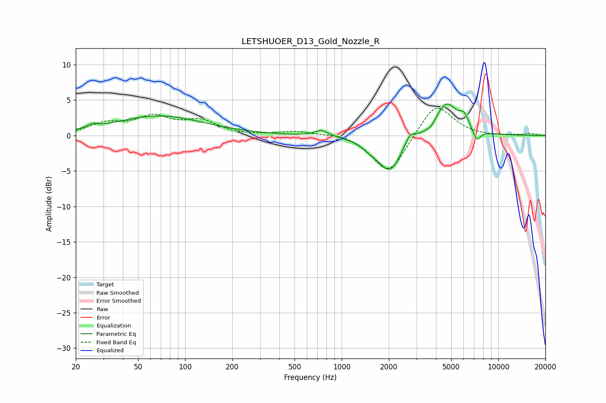

# LETSHUOER_D13_Gold_Nozzle_R
See [usage instructions](https://github.com/jaakkopasanen/AutoEq#usage) for more options and info.

### Parametric EQs
Apply preamp of -4.5 dB when using parametric equalizer.

|   # | Type    |   Fc (Hz) |    Q |   Gain (dB) |
|-----|---------|-----------|------|-------------|
|   1 | Peaking |        26 | 4.51 |         0.5 |
|   2 | Peaking |        68 | 0.5  |         2.8 |
|   3 | Peaking |       744 | 3.38 |         0.9 |
|   4 | Peaking |      1541 | 2.24 |        -1   |
|   5 | Peaking |      2037 | 1.97 |        -4.8 |
|   6 | Peaking |      2727 | 4.63 |         1.3 |
|   7 | Peaking |      3707 | 4.81 |        -0.6 |
|   8 | Peaking |      4670 | 1.92 |         4.7 |
|   9 | Peaking |      6055 | 4.79 |         1.6 |
|  10 | Peaking |      7290 | 5.44 |        -1.6 |

### Fixed Band EQs
When using fixed band (also called graphic) equalizer, apply preamp of **-3.9 dB** (if available) and set gains manually with these parameters.

|   # | Type    |   Fc (Hz) |    Q |   Gain (dB) |
|-----|---------|-----------|------|-------------|
|   1 | Peaking |        31 | 1.41 |         1.6 |
|   2 | Peaking |        62 | 1.41 |         2.4 |
|   3 | Peaking |       125 | 1.41 |         1.9 |
|   4 | Peaking |       250 | 1.41 |        -0   |
|   5 | Peaking |       500 | 1.41 |         0.6 |
|   6 | Peaking |      1000 | 1.41 |         0.5 |
|   7 | Peaking |      2000 | 1.41 |        -5.6 |
|   8 | Peaking |      4000 | 1.41 |         4.8 |
|   9 | Peaking |      8000 | 1.41 |        -0.1 |
|  10 | Peaking |     16000 | 1.41 |         0.2 |

### Graphs

