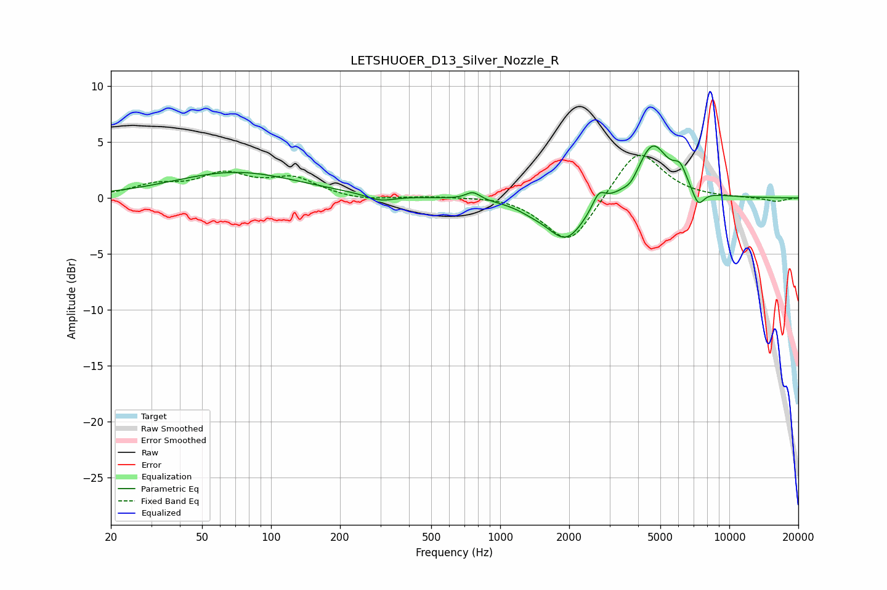

# LETSHUOER_D13_Silver_Nozzle_R
See [usage instructions](https://github.com/jaakkopasanen/AutoEq#usage) for more options and info.

### Parametric EQs
Apply preamp of -4.7 dB when using parametric equalizer.

|   # | Type    |   Fc (Hz) |    Q |   Gain (dB) |
|-----|---------|-----------|------|-------------|
|   1 | Peaking |        70 | 0.52 |         2.3 |
|   2 | Peaking |       300 | 2.31 |        -0.6 |
|   3 | Peaking |       760 | 4.52 |         0.7 |
|   4 | Peaking |      1377 | 2.17 |        -0.4 |
|   5 | Peaking |      1939 | 1.66 |        -3.7 |
|   6 | Peaking |      2696 | 5.09 |         1.4 |
|   7 | Peaking |      3723 | 4.62 |        -0.6 |
|   8 | Peaking |      4624 | 2.05 |         4.9 |
|   9 | Peaking |      6095 | 4.52 |         1.7 |
|  10 | Peaking |      7319 | 5.25 |        -1.5 |

### Fixed Band EQs
When using fixed band (also called graphic) equalizer, apply preamp of **-3.9 dB** (if available) and set gains manually with these parameters.

|   # | Type    |   Fc (Hz) |    Q |   Gain (dB) |
|-----|---------|-----------|------|-------------|
|   1 | Peaking |        31 | 1.41 |         1   |
|   2 | Peaking |        62 | 1.41 |         1.9 |
|   3 | Peaking |       125 | 1.41 |         1.6 |
|   4 | Peaking |       250 | 1.41 |        -0.3 |
|   5 | Peaking |       500 | 1.41 |         0.2 |
|   6 | Peaking |      1000 | 1.41 |         0.2 |
|   7 | Peaking |      2000 | 1.41 |        -4.4 |
|   8 | Peaking |      4000 | 1.41 |         4.6 |
|   9 | Peaking |      8000 | 1.41 |        -0   |
|  10 | Peaking |     16000 | 1.41 |        -0.3 |

### Graphs

