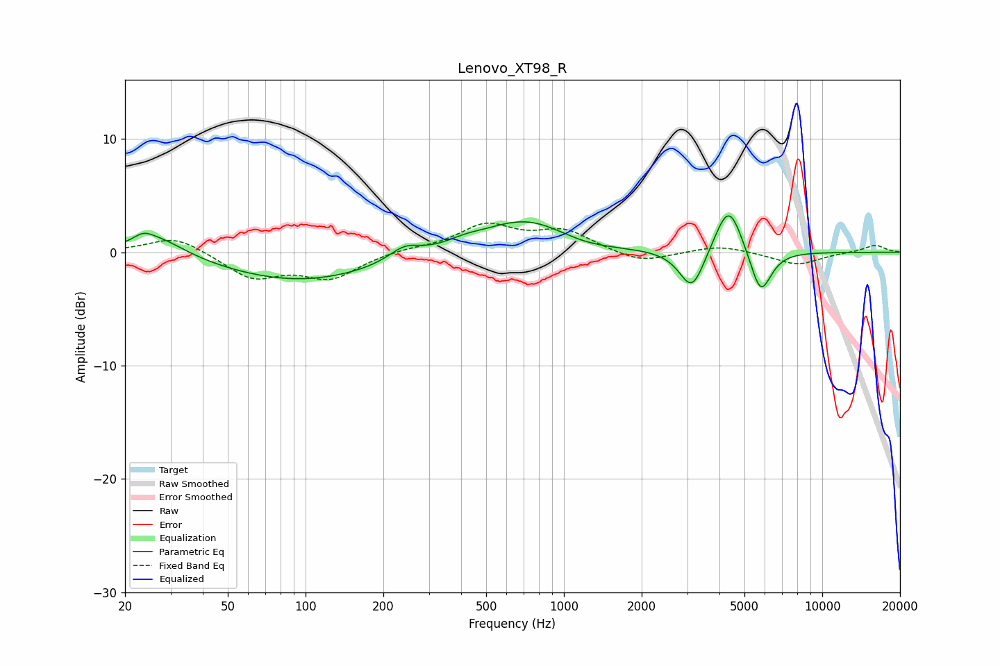

# Lenovo_XT98_R
See [usage instructions](https://github.com/jaakkopasanen/AutoEq#usage) for more options and info.

### Parametric EQs
Apply preamp of -3.3 dB when using parametric equalizer.

|   # | Type    |   Fc (Hz) |    Q |   Gain (dB) |
|-----|---------|-----------|------|-------------|
|   1 | Peaking |        24 | 3.83 |         0.7 |
|   2 | Peaking |        27 | 1.29 |         1.8 |
|   3 | Peaking |        95 | 0.46 |        -2.6 |
|   4 | Peaking |       242 | 2.31 |         1.2 |
|   5 | Peaking |       411 | 1.84 |         0.5 |
|   6 | Peaking |       714 | 0.82 |         3   |
|   7 | Peaking |      1188 | 1.18 |        -0.6 |
|   8 | Peaking |      3134 | 2.91 |        -3.7 |
|   9 | Peaking |      4344 | 2.65 |         4.6 |
|  10 | Peaking |      5775 | 3.34 |        -4.1 |

### Fixed Band EQs
When using fixed band (also called graphic) equalizer, apply preamp of **-2.7 dB** (if available) and set gains manually with these parameters.

|   # | Type    |   Fc (Hz) |    Q |   Gain (dB) |
|-----|---------|-----------|------|-------------|
|   1 | Peaking |        31 | 1.41 |         1.5 |
|   2 | Peaking |        62 | 1.41 |        -2.2 |
|   3 | Peaking |       125 | 1.41 |        -2.2 |
|   4 | Peaking |       250 | 1.41 |         0.3 |
|   5 | Peaking |       500 | 1.41 |         2.3 |
|   6 | Peaking |      1000 | 1.41 |         1.8 |
|   7 | Peaking |      2000 | 1.41 |        -1   |
|   8 | Peaking |      4000 | 1.41 |         0.6 |
|   9 | Peaking |      8000 | 1.41 |        -1.1 |
|  10 | Peaking |     16000 | 1.41 |         0.7 |

### Graphs

