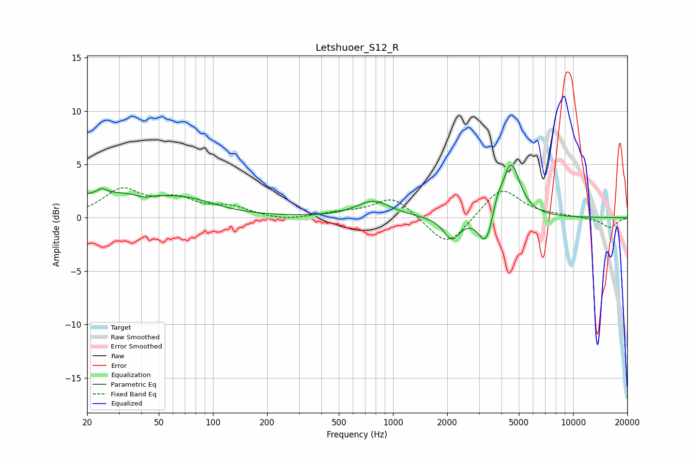

# Letshuoer_S12_R
See [usage instructions](https://github.com/jaakkopasanen/AutoEq#usage) for more options and info.

### Parametric EQs
Apply preamp of -5.0 dB when using parametric equalizer.

|   # | Type    |   Fc (Hz) |    Q |   Gain (dB) |
|-----|---------|-----------|------|-------------|
|   1 | Peaking |        24 | 5.98 |        -2.1 |
|   2 | Peaking |        24 | 5.94 |         2.6 |
|   3 | Peaking |        26 | 0.39 |         2.2 |
|   4 | Peaking |        41 | 3.8  |        -0.3 |
|   5 | Peaking |        75 | 1.01 |         0.8 |
|   6 | Peaking |       779 | 1.49 |         1.5 |
|   7 | Peaking |      2119 | 3.13 |        -2.1 |
|   8 | Peaking |      3278 | 3.54 |        -3.1 |
|   9 | Peaking |      3775 | 5.98 |         1   |
|  10 | Peaking |      4510 | 2.78 |         5.3 |

### Fixed Band EQs
When using fixed band (also called graphic) equalizer, apply preamp of **-2.9 dB** (if available) and set gains manually with these parameters.

|   # | Type    |   Fc (Hz) |    Q |   Gain (dB) |
|-----|---------|-----------|------|-------------|
|   1 | Peaking |        31 | 1.41 |         2.5 |
|   2 | Peaking |        62 | 1.41 |         1.5 |
|   3 | Peaking |       125 | 1.41 |         0.9 |
|   4 | Peaking |       250 | 1.41 |        -0.3 |
|   5 | Peaking |       500 | 1.41 |         0.4 |
|   6 | Peaking |      1000 | 1.41 |         2   |
|   7 | Peaking |      2000 | 1.41 |        -2.9 |
|   8 | Peaking |      4000 | 1.41 |         2.9 |
|   9 | Peaking |      8000 | 1.41 |         0.1 |
|  10 | Peaking |     16000 | 1.41 |        -0.9 |

### Graphs

