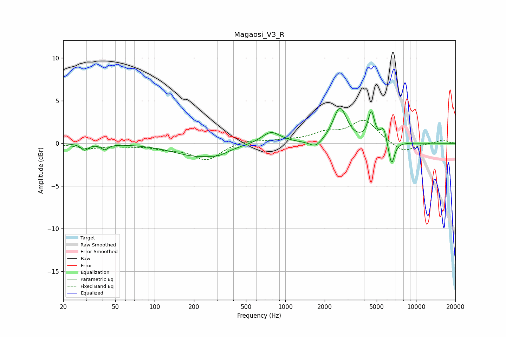

# Magaosi_V3_R
See [usage instructions](https://github.com/jaakkopasanen/AutoEq#usage) for more options and info.

### Parametric EQs
Apply preamp of -4.2 dB when using parametric equalizer.

|   # | Type    |   Fc (Hz) |    Q |   Gain (dB) |
|-----|---------|-----------|------|-------------|
|   1 | Peaking |        29 | 5.37 |        -0.7 |
|   2 | Peaking |        42 | 5.5  |        -0.6 |
|   3 | Peaking |       207 | 0.78 |        -1.4 |
|   4 | Peaking |       310 | 2.01 |        -0.5 |
|   5 | Peaking |       777 | 1.96 |         1.4 |
|   6 | Peaking |      1710 | 2.99 |        -0.9 |
|   7 | Peaking |      2616 | 2.74 |         4.1 |
|   8 | Peaking |      4545 | 5.68 |         3.3 |
|   9 | Peaking |      5647 | 5.97 |         1.7 |
|  10 | Peaking |      6497 | 6    |        -2.8 |

### Fixed Band EQs
When using fixed band (also called graphic) equalizer, apply preamp of **-2.8 dB** (if available) and set gains manually with these parameters.

|   # | Type    |   Fc (Hz) |    Q |   Gain (dB) |
|-----|---------|-----------|------|-------------|
|   1 | Peaking |        31 | 1.41 |        -0.5 |
|   2 | Peaking |        62 | 1.41 |        -0.2 |
|   3 | Peaking |       125 | 1.41 |        -0.5 |
|   4 | Peaking |       250 | 1.41 |        -1.9 |
|   5 | Peaking |       500 | 1.41 |         0.4 |
|   6 | Peaking |      1000 | 1.41 |         0.3 |
|   7 | Peaking |      2000 | 1.41 |         1   |
|   8 | Peaking |      4000 | 1.41 |         2.7 |
|   9 | Peaking |      8000 | 1.41 |        -1.2 |
|  10 | Peaking |     16000 | 1.41 |         0.4 |

### Graphs

