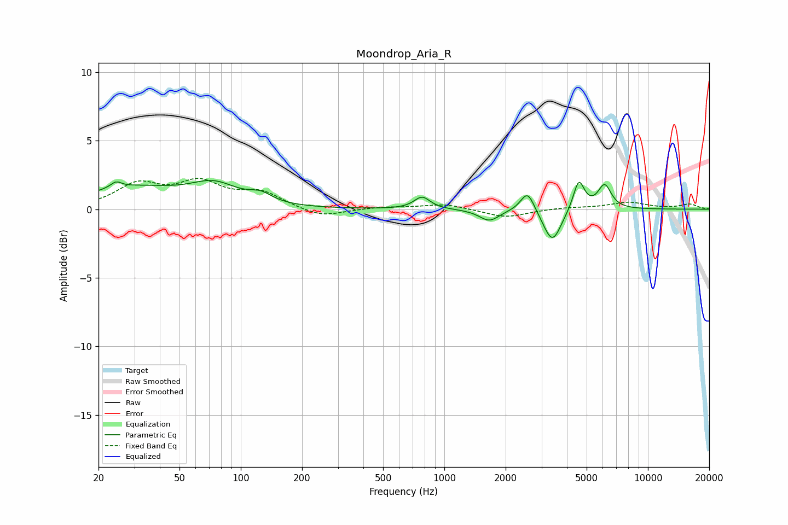

# Moondrop_Aria_R
See [usage instructions](https://github.com/jaakkopasanen/AutoEq#usage) for more options and info.

### Parametric EQs
Apply preamp of -2.2 dB when using parametric equalizer.

|   # | Type    |   Fc (Hz) |    Q |   Gain (dB) |
|-----|---------|-----------|------|-------------|
|   1 | Peaking |        24 | 5.41 |         0.4 |
|   2 | Peaking |        29 | 0.61 |         1.5 |
|   3 | Peaking |        74 | 1.22 |         1.4 |
|   4 | Peaking |       125 | 2.55 |         0.6 |
|   5 | Peaking |       778 | 3.65 |         0.9 |
|   6 | Peaking |      1663 | 2.9  |        -0.8 |
|   7 | Peaking |      2564 | 4.19 |         1.5 |
|   8 | Peaking |      3392 | 3.23 |        -2.5 |
|   9 | Peaking |      4576 | 5.18 |         2.2 |
|  10 | Peaking |      6127 | 4.26 |         1.7 |

### Fixed Band EQs
When using fixed band (also called graphic) equalizer, apply preamp of **-2.3 dB** (if available) and set gains manually with these parameters.

|   # | Type    |   Fc (Hz) |    Q |   Gain (dB) |
|-----|---------|-----------|------|-------------|
|   1 | Peaking |        31 | 1.41 |         1.7 |
|   2 | Peaking |        62 | 1.41 |         1.7 |
|   3 | Peaking |       125 | 1.41 |         1.1 |
|   4 | Peaking |       250 | 1.41 |        -0.6 |
|   5 | Peaking |       500 | 1.41 |         0.1 |
|   6 | Peaking |      1000 | 1.41 |         0.4 |
|   7 | Peaking |      2000 | 1.41 |        -0.6 |
|   8 | Peaking |      4000 | 1.41 |         0.1 |
|   9 | Peaking |      8000 | 1.41 |         0.5 |
|  10 | Peaking |     16000 | 1.41 |         0.4 |

### Graphs

