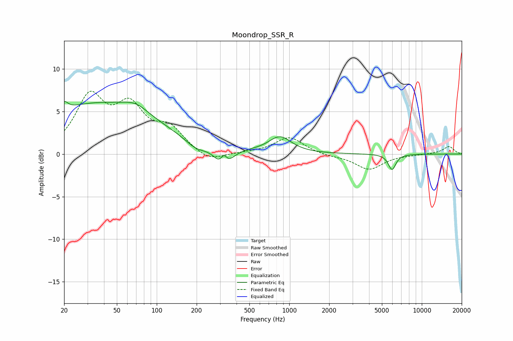

# Moondrop_SSR_R
See [usage instructions](https://github.com/jaakkopasanen/AutoEq#usage) for more options and info.

### Parametric EQs
Apply preamp of -6.3 dB when using parametric equalizer.

|   # | Type    |   Fc (Hz) |    Q |   Gain (dB) |
|-----|---------|-----------|------|-------------|
|   1 | Peaking |        20 | 5.3  |         1   |
|   2 | Peaking |        36 | 0.3  |         5.8 |
|   3 | Peaking |        70 | 1.52 |         1   |
|   4 | Peaking |       201 | 1.58 |        -1.4 |
|   5 | Peaking |       263 | 0.85 |         1   |
|   6 | Peaking |       318 | 2.36 |        -3.4 |
|   7 | Peaking |       321 | 5.29 |         1.8 |
|   8 | Peaking |       852 | 1.67 |         1.9 |
|   9 | Peaking |      5963 | 4.89 |        -1.8 |
|  10 | Peaking |      9889 | 6    |         0   |

### Fixed Band EQs
When using fixed band (also called graphic) equalizer, apply preamp of **-7.5 dB** (if available) and set gains manually with these parameters.

|   # | Type    |   Fc (Hz) |    Q |   Gain (dB) |
|-----|---------|-----------|------|-------------|
|   1 | Peaking |        31 | 1.41 |         6.4 |
|   2 | Peaking |        62 | 1.41 |         4.9 |
|   3 | Peaking |       125 | 1.41 |         2.7 |
|   4 | Peaking |       250 | 1.41 |        -1.1 |
|   5 | Peaking |       500 | 1.41 |         0.1 |
|   6 | Peaking |      1000 | 1.41 |         2   |
|   7 | Peaking |      2000 | 1.41 |        -0.2 |
|   8 | Peaking |      4000 | 1.41 |        -1.8 |
|   9 | Peaking |      8000 | 1.41 |        -0.1 |
|  10 | Peaking |     16000 | 1.41 |         0.9 |

### Graphs

