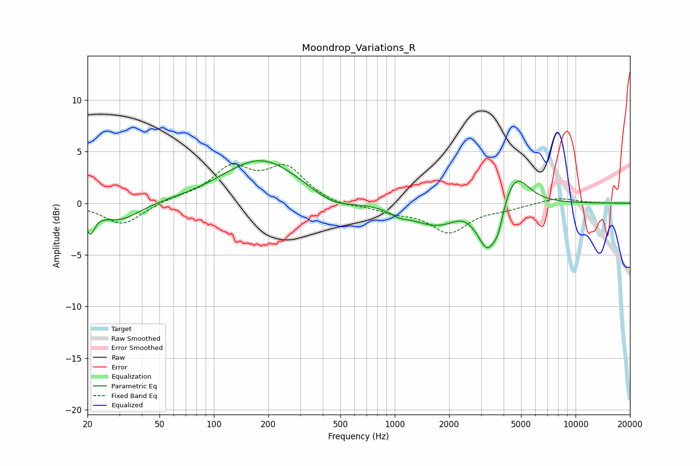

# Moondrop_Variations_R
See [usage instructions](https://github.com/jaakkopasanen/AutoEq#usage) for more options and info.

### Parametric EQs
Apply preamp of -4.2 dB when using parametric equalizer.

|   # | Type    |   Fc (Hz) |    Q |   Gain (dB) |
|-----|---------|-----------|------|-------------|
|   1 | Peaking |        21 | 5.73 |        -2.2 |
|   2 | Peaking |        30 | 1.26 |        -1.7 |
|   3 | Peaking |       183 | 0.67 |         4.3 |
|   4 | Peaking |       451 | 1.28 |        -1.1 |
|   5 | Peaking |      1061 | 2.92 |        -0.5 |
|   6 | Peaking |      1685 | 1.01 |        -2.1 |
|   7 | Peaking |      2339 | 2.72 |         0.4 |
|   8 | Peaking |      3268 | 2.58 |        -4.4 |
|   9 | Peaking |      3737 | 5.14 |        -1.6 |
|  10 | Peaking |      4618 | 1.87 |         3.4 |

### Fixed Band EQs
When using fixed band (also called graphic) equalizer, apply preamp of **-3.9 dB** (if available) and set gains manually with these parameters.

|   # | Type    |   Fc (Hz) |    Q |   Gain (dB) |
|-----|---------|-----------|------|-------------|
|   1 | Peaking |        31 | 1.41 |        -2.1 |
|   2 | Peaking |        62 | 1.41 |         0.4 |
|   3 | Peaking |       125 | 1.41 |         3.2 |
|   4 | Peaking |       250 | 1.41 |         3.2 |
|   5 | Peaking |       500 | 1.41 |        -0.4 |
|   6 | Peaking |      1000 | 1.41 |        -0.7 |
|   7 | Peaking |      2000 | 1.41 |        -2.7 |
|   8 | Peaking |      4000 | 1.41 |        -0.4 |
|   9 | Peaking |      8000 | 1.41 |         0.6 |
|  10 | Peaking |     16000 | 1.41 |        -0   |

### Graphs

