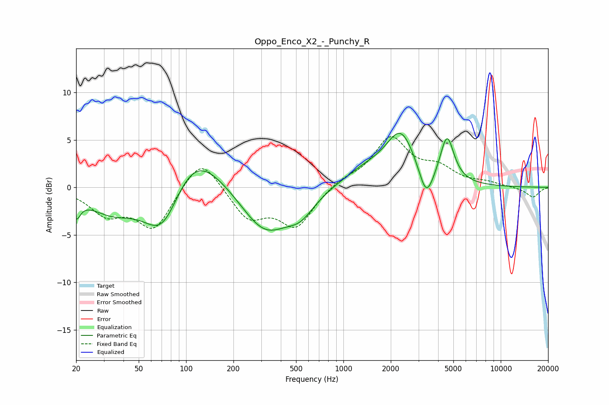

# Oppo_Enco_X2_-_Punchy_R
See [usage instructions](https://github.com/jaakkopasanen/AutoEq#usage) for more options and info.

### Parametric EQs
Apply preamp of -5.8 dB when using parametric equalizer.

|   # | Type    |   Fc (Hz) |    Q |   Gain (dB) |
|-----|---------|-----------|------|-------------|
|   1 | Peaking |        20 | 5.31 |        -2   |
|   2 | Peaking |        34 | 0.9  |        -2.5 |
|   3 | Peaking |        71 | 1.15 |        -6.3 |
|   4 | Peaking |       109 | 0.78 |         5.6 |
|   5 | Peaking |       318 | 0.9  |        -4.9 |
|   6 | Peaking |       535 | 1.64 |        -1.8 |
|   7 | Peaking |      1371 | 0.93 |         1.6 |
|   8 | Peaking |      2324 | 1.48 |         5.4 |
|   9 | Peaking |      3362 | 3.02 |        -3.5 |
|  10 | Peaking |      4558 | 3.23 |         4.8 |

### Fixed Band EQs
When using fixed band (also called graphic) equalizer, apply preamp of **-5.4 dB** (if available) and set gains manually with these parameters.

|   # | Type    |   Fc (Hz) |    Q |   Gain (dB) |
|-----|---------|-----------|------|-------------|
|   1 | Peaking |        31 | 1.41 |        -2.6 |
|   2 | Peaking |        62 | 1.41 |        -4.3 |
|   3 | Peaking |       125 | 1.41 |         3.6 |
|   4 | Peaking |       250 | 1.41 |        -3.2 |
|   5 | Peaking |       500 | 1.41 |        -4   |
|   6 | Peaking |      1000 | 1.41 |         0.8 |
|   7 | Peaking |      2000 | 1.41 |         5.1 |
|   8 | Peaking |      4000 | 1.41 |         1.7 |
|   9 | Peaking |      8000 | 1.41 |         0.4 |
|  10 | Peaking |     16000 | 1.41 |        -1.1 |

### Graphs

