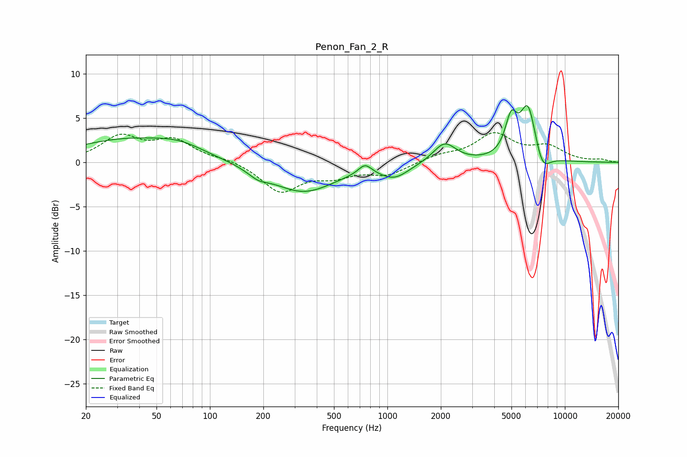

# Penon_Fan_2_R
See [usage instructions](https://github.com/jaakkopasanen/AutoEq#usage) for more options and info.

### Parametric EQs
Apply preamp of -6.5 dB when using parametric equalizer.

|   # | Type    |   Fc (Hz) |    Q |   Gain (dB) |
|-----|---------|-----------|------|-------------|
|   1 | Peaking |        33 | 0.47 |         2.5 |
|   2 | Peaking |        68 | 1.02 |         1.1 |
|   3 | Peaking |       187 | 2.47 |        -0.8 |
|   4 | Peaking |       335 | 0.79 |        -3.3 |
|   5 | Peaking |       748 | 3.8  |         1.2 |
|   6 | Peaking |      1096 | 1.72 |        -1.5 |
|   7 | Peaking |      2098 | 2.21 |         2.3 |
|   8 | Peaking |      4980 | 4.16 |         4   |
|   9 | Peaking |      6205 | 3    |         6.3 |
|  10 | Peaking |      7446 | 3.16 |        -2.3 |

### Fixed Band EQs
When using fixed band (also called graphic) equalizer, apply preamp of **-3.4 dB** (if available) and set gains manually with these parameters.

|   # | Type    |   Fc (Hz) |    Q |   Gain (dB) |
|-----|---------|-----------|------|-------------|
|   1 | Peaking |        31 | 1.41 |         2.8 |
|   2 | Peaking |        62 | 1.41 |         2.3 |
|   3 | Peaking |       125 | 1.41 |         0.4 |
|   4 | Peaking |       250 | 1.41 |        -3.3 |
|   5 | Peaking |       500 | 1.41 |        -1.3 |
|   6 | Peaking |      1000 | 1.41 |        -1.3 |
|   7 | Peaking |      2000 | 1.41 |         0.7 |
|   8 | Peaking |      4000 | 1.41 |         3.1 |
|   9 | Peaking |      8000 | 1.41 |         1.6 |
|  10 | Peaking |     16000 | 1.41 |         0.3 |

### Graphs

