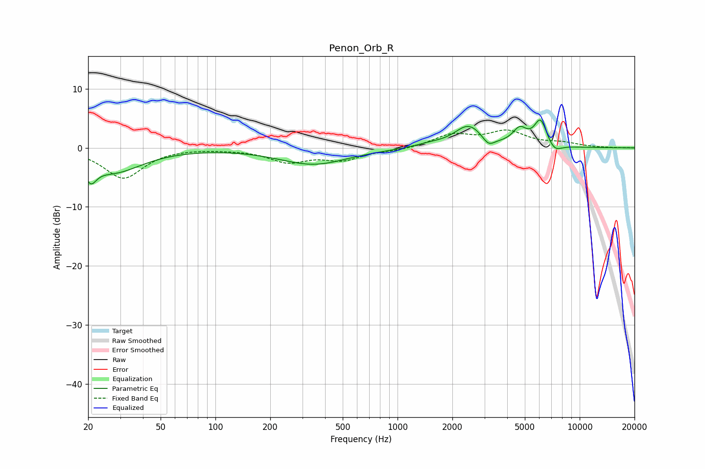

# Penon_Orb_R
See [usage instructions](https://github.com/jaakkopasanen/AutoEq#usage) for more options and info.

### Parametric EQs
Apply preamp of -4.8 dB when using parametric equalizer.

|   # | Type    |   Fc (Hz) |    Q |   Gain (dB) |
|-----|---------|-----------|------|-------------|
|   1 | Peaking |        21 | 4.58 |        -3   |
|   2 | Peaking |        28 | 0.9  |        -4   |
|   3 | Peaking |       346 | 0.75 |        -2.8 |
|   4 | Peaking |      1500 | 1.72 |         0.5 |
|   5 | Peaking |      2456 | 2.87 |        -0.2 |
|   6 | Peaking |      2459 | 1.89 |         3.9 |
|   7 | Peaking |      3156 | 4.3  |        -1.5 |
|   8 | Peaking |      4690 | 3.58 |         2.6 |
|   9 | Peaking |      6099 | 3.89 |         4.5 |
|  10 | Peaking |      7265 | 3.57 |        -1.4 |

### Fixed Band EQs
When using fixed band (also called graphic) equalizer, apply preamp of **-3.1 dB** (if available) and set gains manually with these parameters.

|   # | Type    |   Fc (Hz) |    Q |   Gain (dB) |
|-----|---------|-----------|------|-------------|
|   1 | Peaking |        31 | 1.41 |        -5.1 |
|   2 | Peaking |        62 | 1.41 |         0.1 |
|   3 | Peaking |       125 | 1.41 |        -0.1 |
|   4 | Peaking |       250 | 1.41 |        -2.2 |
|   5 | Peaking |       500 | 1.41 |        -1.9 |
|   6 | Peaking |      1000 | 1.41 |        -0.4 |
|   7 | Peaking |      2000 | 1.41 |         2.1 |
|   8 | Peaking |      4000 | 1.41 |         2.6 |
|   9 | Peaking |      8000 | 1.41 |         0.7 |
|  10 | Peaking |     16000 | 1.41 |        -0   |

### Graphs

