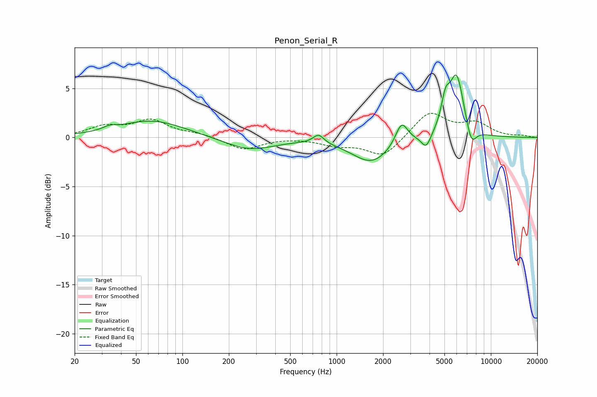

# Penon_Serial_R
See [usage instructions](https://github.com/jaakkopasanen/AutoEq#usage) for more options and info.

### Parametric EQs
Apply preamp of -6.5 dB when using parametric equalizer.

|   # | Type    |   Fc (Hz) |    Q |   Gain (dB) |
|-----|---------|-----------|------|-------------|
|   1 | Peaking |        34 | 3.58 |         0.3 |
|   2 | Peaking |        64 | 0.67 |         1.7 |
|   3 | Peaking |       272 | 0.88 |        -1.3 |
|   4 | Peaking |       763 | 4.14 |         0.9 |
|   5 | Peaking |      1687 | 1.11 |        -2.5 |
|   6 | Peaking |      2637 | 3.52 |         2.3 |
|   7 | Peaking |      3808 | 4.53 |        -1.4 |
|   8 | Peaking |      5078 | 5.06 |         2.6 |
|   9 | Peaking |      5995 | 2.88 |         6.3 |
|  10 | Peaking |      7464 | 4.17 |        -2   |

### Fixed Band EQs
When using fixed band (also called graphic) equalizer, apply preamp of **-2.6 dB** (if available) and set gains manually with these parameters.

|   # | Type    |   Fc (Hz) |    Q |   Gain (dB) |
|-----|---------|-----------|------|-------------|
|   1 | Peaking |        31 | 1.41 |         1   |
|   2 | Peaking |        62 | 1.41 |         1.7 |
|   3 | Peaking |       125 | 1.41 |         0.3 |
|   4 | Peaking |       250 | 1.41 |        -1.2 |
|   5 | Peaking |       500 | 1.41 |         0   |
|   6 | Peaking |      1000 | 1.41 |        -0.7 |
|   7 | Peaking |      2000 | 1.41 |        -2   |
|   8 | Peaking |      4000 | 1.41 |         2.6 |
|   9 | Peaking |      8000 | 1.41 |         1.3 |
|  10 | Peaking |     16000 | 1.41 |         0.2 |

### Graphs

