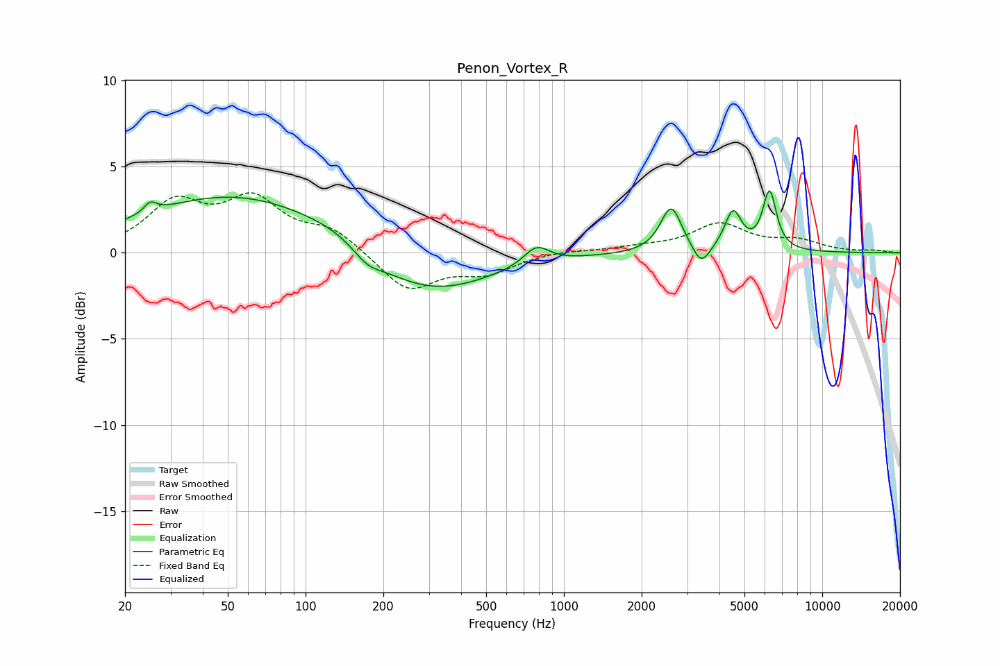

# Penon_Vortex_R
See [usage instructions](https://github.com/jaakkopasanen/AutoEq#usage) for more options and info.

### Parametric EQs
Apply preamp of -3.7 dB when using parametric equalizer.

|   # | Type    |   Fc (Hz) |    Q |   Gain (dB) |
|-----|---------|-----------|------|-------------|
|   1 | Peaking |        25 | 5.94 |         0.6 |
|   2 | Peaking |        54 | 0.38 |         3.4 |
|   3 | Peaking |       136 | 1.12 |         0.5 |
|   4 | Peaking |       173 | 2.55 |        -0.7 |
|   5 | Peaking |       290 | 0.58 |        -2.6 |
|   6 | Peaking |       783 | 2.89 |         1.1 |
|   7 | Peaking |      2603 | 3.46 |         2.7 |
|   8 | Peaking |      3402 | 4.22 |        -1.2 |
|   9 | Peaking |      4517 | 4.33 |         2.3 |
|  10 | Peaking |      6253 | 5.27 |         3.4 |

### Fixed Band EQs
When using fixed band (also called graphic) equalizer, apply preamp of **-3.6 dB** (if available) and set gains manually with these parameters.

|   # | Type    |   Fc (Hz) |    Q |   Gain (dB) |
|-----|---------|-----------|------|-------------|
|   1 | Peaking |        31 | 1.41 |         2.7 |
|   2 | Peaking |        62 | 1.41 |         2.8 |
|   3 | Peaking |       125 | 1.41 |         1.3 |
|   4 | Peaking |       250 | 1.41 |        -2.2 |
|   5 | Peaking |       500 | 1.41 |        -1.1 |
|   6 | Peaking |      1000 | 1.41 |         0.2 |
|   7 | Peaking |      2000 | 1.41 |         0.3 |
|   8 | Peaking |      4000 | 1.41 |         1.6 |
|   9 | Peaking |      8000 | 1.41 |         0.6 |
|  10 | Peaking |     16000 | 1.41 |         0.1 |

### Graphs

