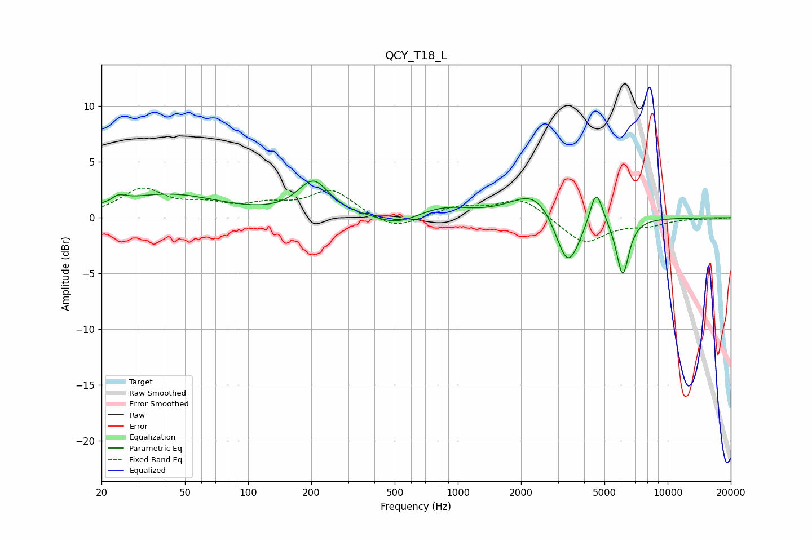

# QCY_T18_L
See [usage instructions](https://github.com/jaakkopasanen/AutoEq#usage) for more options and info.

### Parametric EQs
Apply preamp of -3.4 dB when using parametric equalizer.

|   # | Type    |   Fc (Hz) |    Q |   Gain (dB) |
|-----|---------|-----------|------|-------------|
|   1 | Peaking |        22 | 4.11 |        -1.4 |
|   2 | Peaking |        23 | 3.53 |         1.9 |
|   3 | Peaking |        42 | 0.59 |         2   |
|   4 | Peaking |       205 | 1.91 |         3.1 |
|   5 | Peaking |       510 | 1.57 |        -0.9 |
|   6 | Peaking |       864 | 1.18 |         0.8 |
|   7 | Peaking |      2359 | 1.28 |         2.6 |
|   8 | Peaking |      3337 | 2.36 |        -5.2 |
|   9 | Peaking |      4561 | 4.57 |         3.3 |
|  10 | Peaking |      6105 | 4.63 |        -5.1 |

### Fixed Band EQs
When using fixed band (also called graphic) equalizer, apply preamp of **-2.8 dB** (if available) and set gains manually with these parameters.

|   # | Type    |   Fc (Hz) |    Q |   Gain (dB) |
|-----|---------|-----------|------|-------------|
|   1 | Peaking |        31 | 1.41 |         2.4 |
|   2 | Peaking |        62 | 1.41 |         0.9 |
|   3 | Peaking |       125 | 1.41 |         0.9 |
|   4 | Peaking |       250 | 1.41 |         2.4 |
|   5 | Peaking |       500 | 1.41 |        -1.2 |
|   6 | Peaking |      1000 | 1.41 |         0.9 |
|   7 | Peaking |      2000 | 1.41 |         1.8 |
|   8 | Peaking |      4000 | 1.41 |        -2.3 |
|   9 | Peaking |      8000 | 1.41 |        -0.6 |
|  10 | Peaking |     16000 | 1.41 |        -0.1 |

### Graphs

