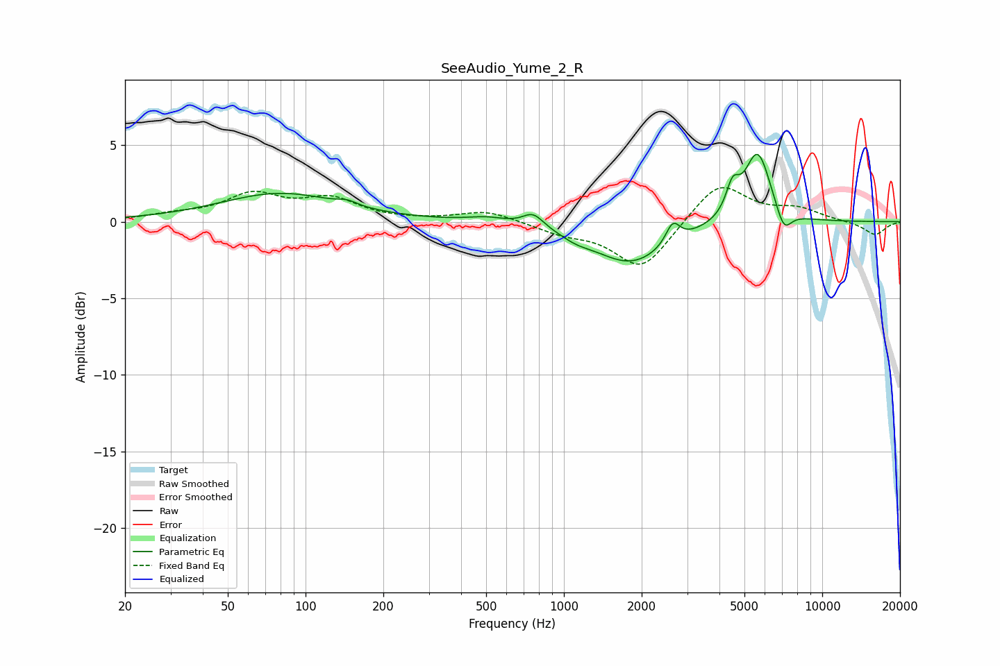

# SeeAudio_Yume_2_R
See [usage instructions](https://github.com/jaakkopasanen/AutoEq#usage) for more options and info.

### Parametric EQs
Apply preamp of -4.5 dB when using parametric equalizer.

|   # | Type    |   Fc (Hz) |    Q |   Gain (dB) |
|-----|---------|-----------|------|-------------|
|   1 | Peaking |        80 | 0.61 |         1.8 |
|   2 | Peaking |       145 | 3.91 |         0.3 |
|   3 | Peaking |       502 | 1.89 |         0.3 |
|   4 | Peaking |       761 | 3.46 |         0.9 |
|   5 | Peaking |      1115 | 2.67 |        -0.3 |
|   6 | Peaking |      1823 | 0.96 |        -2.7 |
|   7 | Peaking |      2641 | 5.2  |         1.4 |
|   8 | Peaking |      4498 | 5.53 |         1.8 |
|   9 | Peaking |      5623 | 2.7  |         4.7 |
|  10 | Peaking |      7096 | 4.52 |        -1.5 |

### Fixed Band EQs
When using fixed band (also called graphic) equalizer, apply preamp of **-2.3 dB** (if available) and set gains manually with these parameters.

|   # | Type    |   Fc (Hz) |    Q |   Gain (dB) |
|-----|---------|-----------|------|-------------|
|   1 | Peaking |        31 | 1.41 |         0.4 |
|   2 | Peaking |        62 | 1.41 |         1.7 |
|   3 | Peaking |       125 | 1.41 |         1.4 |
|   4 | Peaking |       250 | 1.41 |         0   |
|   5 | Peaking |       500 | 1.41 |         0.7 |
|   6 | Peaking |      1000 | 1.41 |        -0.6 |
|   7 | Peaking |      2000 | 1.41 |        -3.1 |
|   8 | Peaking |      4000 | 1.41 |         2.6 |
|   9 | Peaking |      8000 | 1.41 |         0.8 |
|  10 | Peaking |     16000 | 1.41 |        -0.9 |

### Graphs

