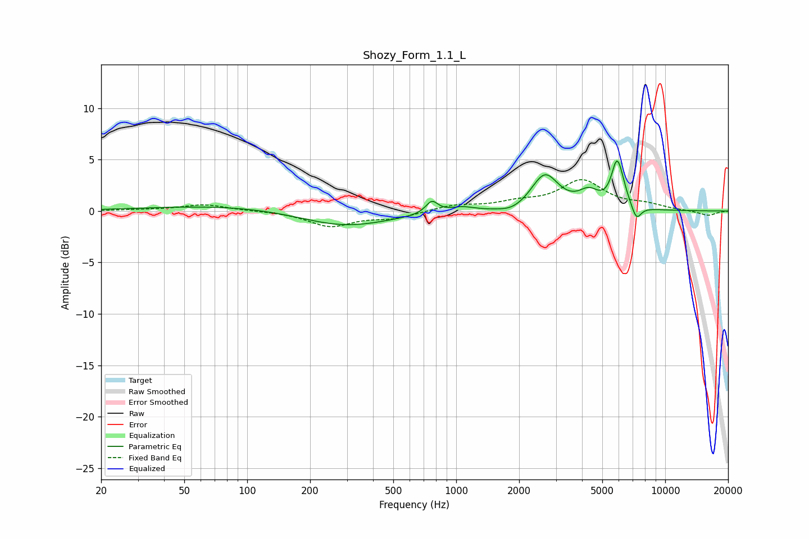

# Shozy_Form_1.1_L
See [usage instructions](https://github.com/jaakkopasanen/AutoEq#usage) for more options and info.

### Parametric EQs
Apply preamp of -5.0 dB when using parametric equalizer.

|   # | Type    |   Fc (Hz) |    Q |   Gain (dB) |
|-----|---------|-----------|------|-------------|
|   1 | Peaking |        89 | 0.36 |         0.6 |
|   2 | Peaking |       289 | 0.65 |        -1.6 |
|   3 | Peaking |       764 | 4.84 |         1.2 |
|   4 | Peaking |      1062 | 2.42 |         0.5 |
|   5 | Peaking |      1863 | 2.18 |        -0.5 |
|   6 | Peaking |      2657 | 2.18 |         3.5 |
|   7 | Peaking |      4311 | 2.88 |         1.4 |
|   8 | Peaking |      5857 | 5.34 |         3.5 |
|   9 | Peaking |      6159 | 4.51 |         1.3 |
|  10 | Peaking |      7280 | 5.86 |        -1.4 |

### Fixed Band EQs
When using fixed band (also called graphic) equalizer, apply preamp of **-3.1 dB** (if available) and set gains manually with these parameters.

|   # | Type    |   Fc (Hz) |    Q |   Gain (dB) |
|-----|---------|-----------|------|-------------|
|   1 | Peaking |        31 | 1.41 |         0.1 |
|   2 | Peaking |        62 | 1.41 |         0.6 |
|   3 | Peaking |       125 | 1.41 |         0   |
|   4 | Peaking |       250 | 1.41 |        -1.5 |
|   5 | Peaking |       500 | 1.41 |        -0.6 |
|   6 | Peaking |      1000 | 1.41 |         0.5 |
|   7 | Peaking |      2000 | 1.41 |         0.7 |
|   8 | Peaking |      4000 | 1.41 |         2.9 |
|   9 | Peaking |      8000 | 1.41 |         0.5 |
|  10 | Peaking |     16000 | 1.41 |        -0.5 |

### Graphs

